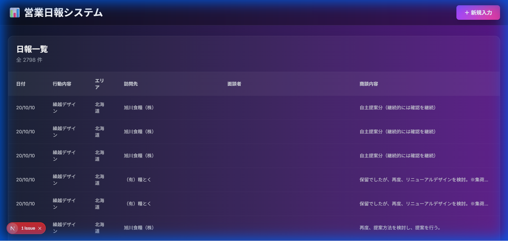
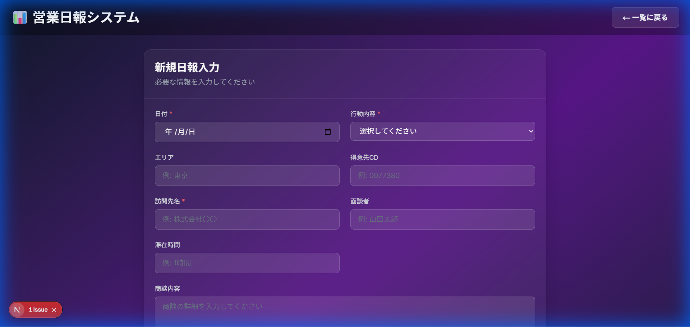

# 営業日報システム (Daily Report System)

エクセルベースの日報を、モダンなWebインターフェースで管理できるシステムです。

## ✨ 特徴

- 📊 **エクセル連携**: 既存のエクセルファイル（`.xlsm`）の関数やマクロを保持
- 🎨 **モダンUI**: ダークテーマ、グラデーション、ガラスモーフィズム
- 📝 **簡単入力**: 直感的な入力フォーム
- 📱 **レスポンシブ**: PC・タブレット・スマホ対応

## 📸 スクリーンショット

### 日報一覧画面


### 日報入力画面


## 🚀 クイックスタート

### 1. バックエンドを起動
```powershell
cd backend
py main.py
```

### 2. フロントエンドを起動（別のターミナルで）
```powershell
cd frontend
npm run dev
```

### 3. ブラウザでアクセス
`http://localhost:3000` を開く

## 📁 プロジェクト構成

```
daily-report-system/
├── backend/              # Python FastAPI バックエンド
│   ├── main.py          # メインAPIファイル
│   └── requirements.txt # Python依存関係
├── frontend/            # Next.js フロントエンド
│   ├── app/
│   │   ├── page.tsx    # 日報一覧ページ
│   │   └── input/
│   │       └── page.tsx # 日報入力ページ
│   └── package.json
├── screenshots/         # UIスクリーンショット
├── daily_report_template.xlsm  # エクセルデータファイル
└── 使い方ガイド.md              # 詳細な使い方
```

## 🛠️ 技術スタック

### バックエンド
- Python 3.13
- FastAPI
- pandas
- openpyxl

### フロントエンド
- Next.js 16
- React
- TypeScript
- Tailwind CSS

## 📖 詳細ドキュメント

詳しい使い方は [使い方ガイド.md](./使い方ガイド.md) をご覧ください。

## 🎯 現在の実装状況

### ✅ Phase 1: 完了
- [x] バックエンドAPI（FastAPI）
- [x] エクセルファイルの読み込み
- [x] 日報一覧表示
- [x] NaN/無限値の適切な処理

### ✅ Phase 2: 完了
- [x] 日報入力フォーム
- [x] エクセルファイルへの書き込み
- [x] 管理番号の自動採番

### 🔜 Phase 3: 今後の予定
- [ ] 分析機能（グラフ表示）
- [ ] カレンダー表示
- [ ] 検索・フィルター機能

## 📝 ライセンス

MIT License - 詳細は [LICENSE](./LICENSE) をご覧ください。
