# 営業日報システム (Daily Report System) 詳細取扱説明書

本マニュアルは、エクセルベースの営業日報をモダンなWebインターフェースで効率的に管理・分析するための「営業日報システム」の導入・操作・保守に関する詳細な取扱説明書です。PCの操作に不慣れな一般ユーザー様からシステム管理者様まで、全員が迷わず安心して使用できるように構成されています。

---

## 🧭 目次

* [🔰 PCが苦手な方向け：かんたん1分スタートガイド](#-pcが苦手な方向けかんたん1分スタートガイド)
* [1. システム概要と特徴](#1-システム概要と特徴)
* [2. 動作環境と事前準備](#2-動作環境と事前準備)
* [3. システム起動・セットアップ方法（一般ユーザー向け）](#3-システム起動セットアップ方法一般ユーザー向け)
* [4. 各画面の構成と操作マニュアル](#4-各画面の構成と操作マニュアル)
* [5. Excel連携およびデータ管理の仕様（一般ユーザー向け）](#5-excel連携およびデータ管理の仕様一般ユーザー向け)
* [6. お助けトラブルシューティング（症状から探す）](#6-お助けトラブルシューティング症状から探す)
* [7. 管理者・保守担当者向け情報（※一般ユーザーは読まなくてOK）](#7-管理者保守担当者向け情報一般ユーザーは読まなくてok)

---

## 🔰 PCが苦手な方向け：かんたん1分スタートガイド

「パソコンの操作が少し苦手...」「難しい用語や設定はよく分からない...」という方は、**まずここだけ読めば今日からすぐに日報システムを使えます！**

### 🌸 今日から使える！かんたん3ステップ

#### 1. 【ステップ 1】起動する（カチカチと2回押すだけ）
1. 配布されたフォルダ内にある **`DailyReportServer.exe`** をダブルクリック（カチカチと2回左クリック）します。
   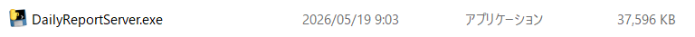
   *📸 差し替え手順: `docs_images/start_01_exe.png` としてスクリーンショット画像を保存してください。*
2. 自動的に黒い画面（コマンドプロンプト）が立ち上がり、システムサーバーが起動します。
   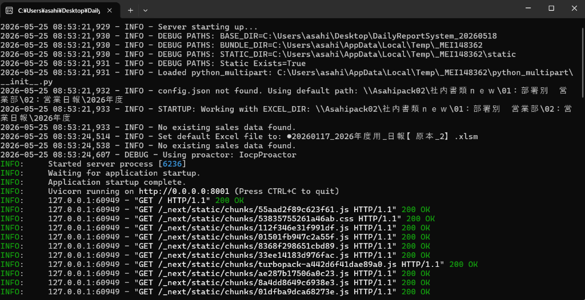
   *📸 差し替え手順: `docs_images/start_02_cmd.png` としてスクリーンショット画像を保存してください。*
3. 自動的にインターネットブラウザが立ち上がり、日報システムの画面が表示されます。
   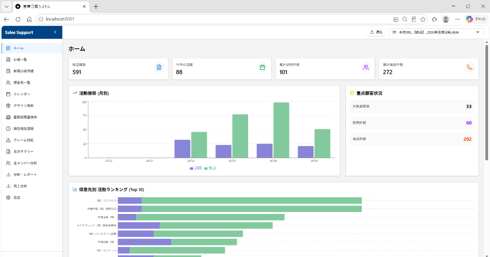
   *📸 差し替え手順: `docs_images/start_03_browser.png` としてスクリーンショット画像を保存してください。*
   * ※もし自動で開かない場合は、ブラウザ（Google Chromeなど）を開き、アドレスバーに **`http://localhost:8001`** と入力してEnterキーを押してください。
   * **⚠️ 安心してください**: `DailyReportServer.exe` を起動すると、英語の文字が並んだ「黒い画面」が開きますが、ウイルスや故障ではありません。システムが正常に動いている証拠ですので、そのまま数秒お待ちください。
   * **💡 黒い画面（コマンドプロンプト）は閉じないで**: この黒い画面は「システムが裏側でがんばって動いている印」です。**絶対に「×」ボタンで閉じないでください。** 邪魔な場合は、画面右上にある「ー」（最小化）ボタンを押して、画面の一番下に隠しておいてください。

#### 2. 【ステップ 2】日報を入力する（手取り足取り解説！）

> [!IMPORTANT]
> **⚠️ 入力を始める前の超重要チェック！**
> 必ず最初に、画面上部に表示されているファイル名が**「自分専用のエクセル（例：日報_自分の名前.xlsm）」になっていることを確認**してください。別人のファイル名になっていると、間違って他人のデータに書き込まれてしまいます！

1. **最初に自分のエクセルになっているか確認する（★超重要！）**:
   * 画面の最上部を確認し、**現在選択されているエクセルファイルの名前が「自分専用のエクセル（例：日報_自分の名前.xlsm）」になっていることを必ず確認してください。**
   * ※もし別人のファイル名が表示されている場合は、間違って別のファイルに書き込まれてしまいます。その場合は、ホーム画面のファイル切り替え機能から正しいファイルを選び直すか、システム管理者へ連絡してください。
   
   *📸 差し替え手順: `docs_images/start_04_confirm_file.png` としてスクリーンショット画像を保存してください。*
2. **「新規日報入力」の画面を開く**:
   * 画面の左側にあるメニューの中から、**「📝 新規日報入力」**（画面上では「日報一括入力」）と書かれた文字を1回クリックします。
   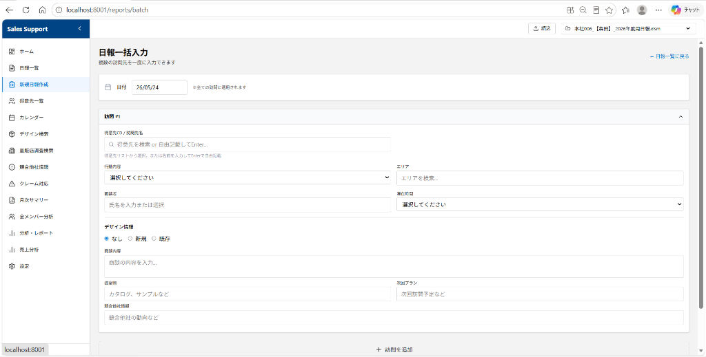
   *📸 差し替え手順: `docs_images/start_05_menu_click.png` としてスクリーンショット画像を保存してください。*
3. **日付を確認・変更する**:
   * **「日付」** の白い枠には、最初から **「今日の日付（当日）」が自動的に入っています。**
   * そのため、当日の日報を書く場合は**何もしなくて大丈夫です。**
   * ※昨日の日報を後から書くなど、「後日入力」をする場合だけ、枠をクリックして日付を変更してください。（枠の右側のカレンダーマークを押して日付を選ぶと簡単です）。
4. **活動した「得意先」を入力する（キーワード検索もできます）**:
   * **「得意先」** の入力欄に、取引先の名前やコードをキーボードで入力します。
   * 文字を入れると、**データベース（エクセルファイル）から自動的に探し出して候補リストを表示してくれます。** 表示されたリストの中から、当てはまる得意先をクリックして選びます。
   * **💡 リストにない場合**: 新しい取引先など候補リストにない場合は、そのままキーボードで名前を入力し、キーボードの「Enter」キーを押す（または入力欄の枠外を適当にクリックする）ことで、**自由に入力することも可能**です。
   * ※「社内（半日・１日）」や「量販店調査」、「外出時間」を登録したい場合は、この得意先欄は何も触らず空欄のままにして、次のステップへ進みます。
   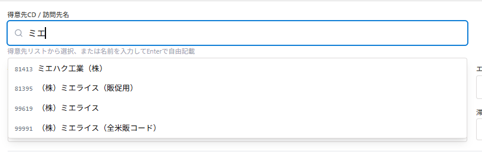
   *📸 差し替え手順: `docs_images/start_06_customer_suggest.png` としてスクリーンショット画像を保存してください。*
5. **「行動内容」と「エリア」を選ぶ**:
   * **「行動内容」** のプルダウン（▼マーク）をクリックし、当てはまるものを1つ選びます。
     * 選択肢: `-` (選択なし), `訪問（アポあり）`, `訪問（アポなし）`, `訪問（新規）`, `訪問（クレーム）`, `電話商談`, `電話アポ取り`, `メール商談`, `量販店調査`, `社内（半日）`, `社内（１日）`, `外出時間`, `その他`
     * **💡 自動絞り込み機能**: 先に得意先が入力されていると、プルダウンの中から「社内（半日）」や「外出時間」といった関係のない選択肢が**自動的に非表示**になり、訪問や電話アポなどの「今選ぶべき選択肢」だけがスッキリと残るため、迷うことがありません！
     * ※得意先を入力せずに「外出時間」を選んだ場合のみ、専用の「外出活動時間（30分刻み）」と「満足度（0%〜100%）」を入力する枠が自動的に出現します。
   * 行動内容を選択後、その右側にある **「エリア」** 欄をクリックして、担当エリアを検索・選択します（顧客リストから選択した場合は自動で記載されます）。
   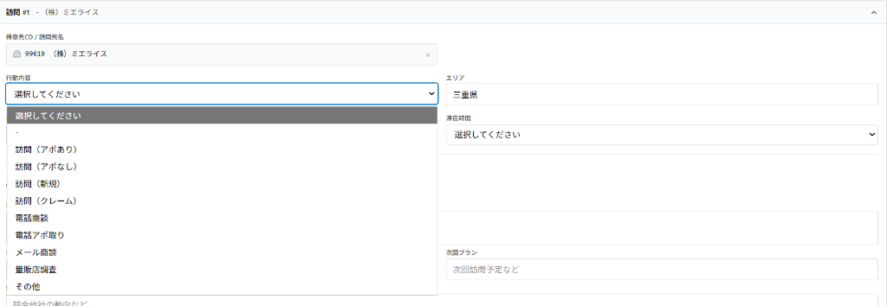
   *📸 差し替え手順: `docs_images/start_07_activity_area.png` としてスクリーンショット画像を保存してください。*
6. **面談者、滞在時間を書く**:
   * **「面談者」** の枠に会った人の名前を書き、**「滞在時間」** も必要に応じて以下から選びます。
     * 滞在時間の選択肢: `-` (選択なし), `10分未満`, `30分未満`, `60分未満`, `60分以上`
   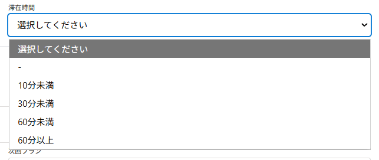
   *📸 差し替え手順: `docs_images/start_08_interview.png` としてスクリーンショット画像を保存してください。*
7. **デザインに関係する仕事をした場合（必要に応じて）**:
   * デザイン提案欄のラジオボタンから「新規」または「既存」を選びます。
   * **「新規」を選んだ場合**は、以下の4項目を入力・選択します:
     * **デザイン依頼No.**: デザイン案件を管理するための依頼番号をテキストで入力します。
     * **デザイン種別**: プルダウンから `-` (選択なし), `別注（新版）`, `別注（改版）`, `別注（再版）`, `SP（新版）` のいずれかを選びます。
     * **デザイン名**: そのデザイン案件の具体的ない名前や内容をテキストで入力します。
     * **デザイン進捗状況**: プルダウンから `-` (選択なし), `新規`, `50％未満`, `80％未満`, `80％以上`, `出稿`, `不採用（コンペ負け）`, `不採用（企画倒れ）`, `保留` のいずれかを選びます。
   * **「既存」を選んだ場合**は、プルダウンから対象のデザインを選択します。
   * ※デザインのやり取りがない場合は、ラジオボタン「なし」のままで大丈夫です。
   
   *📸 差し替え手順: `docs_images/start_09_design.png` としてスクリーンショット画像を保存してください。*
8. **「商談内容（コメント）」や提案物、次回プランを書く**:
   * **「商談内容（コメント）」** の広い枠をクリックし、その日の商談の様子や活動内容をキーボードで自由に書き込みます。
   * **「提案物」** や **「次回プラン」** がある場合も、それぞれの枠をクリックして入力します。
   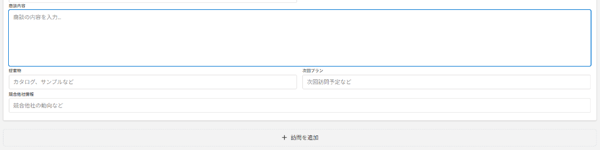
   *📸 差し替え手順: `docs_images/start_10_comment.png` としてスクリーンショット画像を保存してください。*
9. **緑色の「保存する」ボタンを押す**:
   * すべて入力し終えたら、画面を一番下までスクロールし、大きな緑色の **「保存する」** ボタンを1回クリックします。
   * **⚠️ ここで数秒お待ちください（重要）**: ボタンを押してから、裏側でエクセルファイルに安全に書き込みを行い、同時にバックアップを作成するため、**保存完了（次のステップの完了メッセージが出る）までに数秒程度の時間がかかります。**
   * ボタンが「保存中...」と表示されている間は、画面を閉じたり、ボタンを何度も連打したりせず、画面が切り替わるまでそのままでお待ちください。
   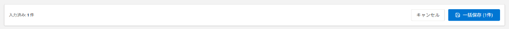
   *📸 差し替え手順: `docs_images/start_11_save_button.png` としてスクリーンショット画像を保存してください。*
10. **「保存しました！」を確認する**:
   * 画面の上部に **「1件の日報を保存しました」**（または複数件ならその件数）と書かれた緑色のメッセージが表示されたら、無事にエクセルへ書き込まれました。これで今日の入力は完了です！
   
   *📸 差し替え手順: `docs_images/start_12_save_success.png` としてスクリーンショット画像を保存してください。*

#### 3. 【ステップ 3】終わる（閉じるだけ）
1. 入力が終わったら、インターネットの画面（ブラウザ）を「×」ボタンで閉じて終了して構いません。
2. もし【ステップ1】で黒い画面（コマンドプロンプト）がデスクトップ上に残っている場合は、最後にその黒い画面の「×」ボタンを押して閉じてください。これで完全に終了します。

---

## 1. システム概要と特徴

本システムは、従来のエクセル（`.xlsm`）による日報管理の良さ（関数やマクロ、ネットワーク共有による管理）をそのまま活かしつつ、入力作業のストレスを軽減し、データの検索・分析能力を大幅に強化したハイブリッド型業務システムです。

```mermaid
graph TD
    User([ユーザー]) <-->|ブラウザ (モダンWeb UI)| Frontend[フロントエンド画面]
    Frontend <-->|API通信 (JSON)| BackendExe[バックエンド実行ファイル: DailyReportServer.exe]
    BackendExe <-->|openpyxl / pandas| ExcelFile[(共有エクセルファイル .xlsm)]
    BackendExe -->|自動実行 (非同期)| Backup[(履歴バックアップフォルダ backup/)]
```

### ✨ 主な特徴とメリット
* **既存エクセルの完全再利用**: エクセル内に書き込まれた関数やマクロ、書式を壊すことなく、Web画面から直接データの読み書きを行います。新規保存時には、直前の行からセル書式（フォントや色、罫線、表示形式など）を自動でコピーして追加するため、エクセルの見た目の美しさや統一性もそのまま維持されます。
* **直感的で洗練されたUI**: 営業担当者がPCからストレスなく迅速に入力できるよう、モダンで美しいカード型デザインを採用しています。
* **オフライン対応と自動同期**: 移動中や圏外でもブラウザ上（PWA）に下書きとして一時保存ができ、オンライン復帰時に自動的にエクセル原本へ同期されます。
* **高度な検索と見える化**: 大量の日報データから、得意先やデザイン種別によるクロス検索、活動量グラフ、メンバーの状況比較などをビジュアルに分析可能です。
* **超高速なマルチレイヤキャッシュ**: 動作が重くなりがちな共有サーバー上のエクセル読み込みですが、システム内部に「メモリキャッシュ」と「ディスクキャッシュ（.cache）」を完備。エクセルが更新された場合のみ再読み込みを行うインテリジェントな設計により、瞬時の表示・検索を実現しています。
* **安心のデータ保護（履歴バックアップ）**: 日報保存の直後に、エクセルと同じ場所に `backup` フォルダが自動生成され、タイムスタンプ付きの複製ファイル（例：`日報_2026_20260524_160000.xlsm`）を非同期のバックグラウンド処理で安全に保存します。万が一のフリーズやネットワーク瞬断が発生しても、任意の保存時点へ即座に復旧可能です。

---

## 2. 動作環境と事前準備

本システムを利用するにあたり、以下の環境および準備が必要です。

### 💻 クライアントPC環境
* **OS**: Windows 10 / 11 (64bit)
* **ブラウザ**: モダンなWebブラウザ (Google Chrome, Microsoft Edge 推奨)
* **ネットワーク**: 社内LAN環境（または社外からのVPN接続環境）
  * 共有フォルダ上のエクセルファイル（`\\Asahipack02` 等）に直接読み書きを行うため、対象の共有サーバーにエクスプローラー等からアクセスできる状態である必要があります。

### 🔑 動作のための前提条件・事前確認
* **エクセル（Microsoft Excel）インストール不要**:
  * 本システムは内部で直接エクセルファイルを高速制御（FastAPI + pandas + openpyxl）しているため、**クライアントPCにMicrosoft Excelのソフト本体がインストールされていなくてもシステムは完璧に動作します。** (ただし、最終成果物である `.xlsm` 原本ファイルをExcelソフトで開いて確認・印刷する場合はExcelが必要です)。
* **共有フォルダへのアクセス権限（読み書き権限）**:
  * エクセル原本に対して直接データの更新やバックアップ複製を行うため、ご利用のWindowsユーザーアカウントに、対象のネットワーク共有フォルダに対する**「読み取り（Read）」および「書き込み（Write）」の両方のアクセス権限**が付与されている必要があります。事前にWindowsのエクスプローラーから該当のフォルダを開き、新しいファイルの作成や編集・上書きが問題なく実行できることを確認してください。
* **空きポートの確保（ポート: `8001`）**:
  * システムサーバーである `DailyReportServer.exe` は、PC内でローカルWebサーバー（ポート: `8001`）を立ち上げます。そのため、ポート `8001` が他のシステムやアプリに占有されていないこと、およびPCのセキュリティソフトによるローカルホスト（`127.0.0.1` / `localhost`）間の通信制限が解除されている必要があります。
* **セキュリティ警告への理解（初回起動時のみ）**:
  * 会社独自で開発・パッケージングされた独自プログラムであるため、初回ダブルクリック時にWindows Defender SmartScreen等のセキュリティソフトによる警告メッセージが表示されることがあります。これは署名のないアプリに対する一般的な通知であり、安全上の問題はありません。事前に実行許可（「詳細情報」をクリックして「実行」ボタンを押す）の操作手順についてご確認ください。

---

## 3. システム起動・セットアップ方法（一般ユーザー向け）

本システムは、複雑な環境構築（PythonやNode.jsのインストールなど）を行うことなく、パッケージ化された起動プログラムを実行するだけで簡単に起動できます。

### 🚀 推奨の起動方法
1. システムフォルダ内にある **`DailyReportServer.exe`** をダブルクリックして実行します。
2. 黒いコマンドプロンプト画面が立ち上がり、自動的にシステムサーバーが起動します。
3. 自動的にインターネットブラウザが立ち上がり、日報システムの画面が表示されます。
   * ※もし自動で開かない場合は、ブラウザを開き、アドレスバーに **`http://localhost:8001`** と入力してアクセスしてください。

> [!IMPORTANT]
> **🤖 黒い画面（コマンドプロンプト）に関する超重要なお願い**
> * `DailyReportServer.exe` を起動した際に表示される「英語の文字がいろいろ書いてある黒い画面」は、システムの裏側で働くエンジンです。
> * **システムを使用している間は、絶対にこの黒い画面を「×」ボタンで閉じないでください！** 閉じるとシステムが停止し、保存などの操作ができなくなります。
> * 画面が邪魔なときは、右上にある「ー」（最小化）ボタンを押して、画面の一番下に隠してお使いください。

---

## 4. 各画面の構成と操作マニュアル

本システムは、左側のナビゲーションメニュー（サイドバー）から各機能へ簡単にアクセスできます。サイドバーが縮小（折りたたみ）されている場合は、上部の三本線（メニュー）アイコンを押すことで開閉可能です。

---

### 📊 ① ホーム（ダッシュボード）


*📸 差し替え手順: `docs_images/01_dashboard.png` としてスクリーンショット画像を保存してください。*

起動後に最初に表示される、全体の活動状況の「見える化」を行う画面です。
※なお、Excel ファイルの管理（アクティブファイルの確認・切り替え）は、ホーム画面だけでなく、どの画面からでも操作できるように「画面上部のヘッダー」に配置されています。

#### 🔹 主な機能と活用方法:
1. **アクティブファイルの切り替え（上部ヘッダーでどこからでも可能）**:
   * 現在システムが読み書きしているエクセルファイル名（例：`日報_2026.xlsm`）が、どの画面でも常に最上部（ヘッダー）の選択リストに表示されます。
   * 別のエクセルに切り替えるには、上部ヘッダーのプルダウンメニューからファイル名を選ぶだけで瞬時に切り替わります。
   * 新しいファイルを取り込む場合は、プルダウンの左隣にある **「読込」** ボタン（アップロードボタン）をクリックし、パソコン内の対象ファイル（`.xlsx` または `.xlsm`）を選択することでシステムに登録・読み込ませることができます。
2. **新着上長コメントの通知・確認（返信/既読のポップアップ）**:
   * エクセルファイル内に未読の上長コメント（またはコメント）がある場合、**画面上部に赤色の目立つ枠で「新着コメントがあります」と自動通知**されます。
   * **その場で返信・既読にできる**: コメントに対して「返信」ボタンから直接メッセージを返したり、「既読」ボタンを押すことで、エクセルを直接触らずにその場で素早く対応できます。
   * **詳細ポップアップ**: 表示されている日報をクリックすると、画面上にポップアップ（モーダル）が開き、当日の詳細内容の確認や修正が可能です。
3. **活動サマリーカード**:
   * 今月の「訪問件数」および「電話連絡数」の合計値がカード形式で強調表示されます。
4. **月次活動実績推移グラフ**:
   * 月別の訪問数・電話連絡数の推移がビジュアルグラフで描画され、営業活動の波やアプローチ実績を一目で把握できます。

---

### 📋 ② 日報一覧

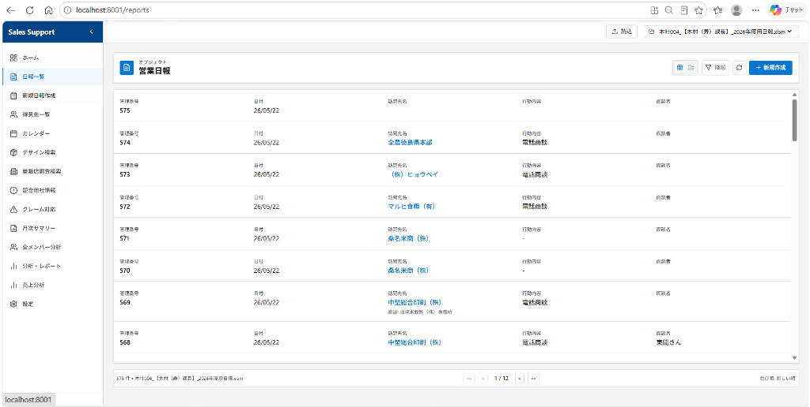
*📸 差し替え手順: `docs_images/02_report_list.png` としてスクリーンショット画像を保存してください。*

過去に登録された日報を、一覧表形式で閲覧・検索する画面です。

#### 🔹 主な機能と詳細な活用方法:
1. **選べる2つの表示モード（テーブル表示 / タイムライン表示）**:
   * 画面右上のアイコンから、用途に合わせて表示スタイルを切り替えられます。
     * **📊 テーブル表示（デフォルト）**: 表形式のコンパクトな一覧です。管理番号、日付、訪問先、行動内容、面談者がスッキリ並び、多くのデータを一覧するのに最適です。
     * **⏳ タイムライン表示**: 時系列カード形式の一覧です。クリックしなくても「商談内容」「次回プラン」「デザイン進捗」「上長コメント」などの本文がすべて縦スクロールで一発で見渡せ、読み物に最適です。
2. **日付による昇順・降順ソート（並び替え）**:
   * フィルターボタンをクリックするだけで、**「新しい順（降順）」** と **「古い順（昇順）」** を瞬時に切り替え可能です。日付が同一の場合は、管理番号の大きい順（後から登録した順）に自動的に整列されます。
3. **50件ごとの高速ページネーション**:
   * データの読み込みや描画を軽快に保つため、日報は1ページあたり50件に制限されて表示されます。ページ下部のボタンを使って、最初・前・次・最後のページへ快適に行き来できます。
4. **クイックリフレッシュ（最新化）**:
   * 右上の矢印マーク（更新ボタン）を押すことで、他の人が直接エクセルを開いて変更した場合などでも、ページ全体を再読み込みすることなく最新のエクセルデータを一瞬で再取得しキャッシュを更新します。
5. **前後の日報へ快適に移動できる詳細ポップアップ（モーダル）**:
   * テーブル表示の行をクリックすると詳細ポップアップ（モーダル）が開きます。
     * **「前へ」「次へ」ボタン**: ポップアップを一度閉じることなく、ポップアップを開いたままキーボード感覚で前後の日報を連続して閲覧・チェックできます。
     * **シームレスな「編集」機能**: 詳細画面内にある「編集」ボタンを押すと、その場で編集画面に切り替わり、エクセルデータを直接安全に書き換えることができます。
     * **💬 上長コメントの確認・返信機能**:
       * **課員（一般営業担当者）の場合**:
         * **指導の迅速な確認**: 詳細画面を開くと、上長から入力されたアドバイスや指示（**上長コメント**: Excel W列/23列目）をその場でリアルタイムに確認できます。
         * **シームレスな返信**: 指導に対して、詳細画面上の「**コメント返信欄**（Excel X列/24列目）」に直接メッセージを入力し、その場で即座にエクセル原本を更新できます。通常の編集画面へ切り替える必要がないため、数秒で確認と返信を完了でき、入力負担を最小限に抑えられます。
       * **指導・管理側（上長）の場合**:
         * **ダイレクトな指導入力**: 課員の日報内容に対し、詳細画面上の「**上長コメント**（Excel W列/23列目）」に直接指導内容やアドバイスを記入して安全に保存できます（バックエンドAPI: `updateReportComment` を使用）。
         * **円滑な双方向コミュニケーション**: コメントを記入後、課員から「コメント返信欄」に入力された回答やその後の進捗を詳細画面内で一元的にキャッチアップでき、Excelの共有競合や同時オープン問題を気にせず、スムーズな指導・フォローを行えます。
     * **☑️ 承認チェックボックス機能（役職者・既読確認用）**:
       * **課員（一般営業担当者）の場合**:
         * **決裁状況の見える化**: 自分の日報がどの役職まで回覧・確認されているか（既読、中野次長、上長、岡本常務、山澄常務）の進捗状況を、詳細モーダル内で一目で確認できます。
       * **決裁・承認側（上長・役職者）の場合**:
         * **ワンクリックでExcelへ即時反映**: 日報を確認後、詳細画面上に配置された自身の役職または役割のチェックボックスをクリックするだけで、Excel原本の該当セル（Y列〜AC列）へ承認フラグ（`1` または空欄）が瞬時にトグル保存されます（バックエンドAPI: `updateReportApproval` を使用）。
         * **連続チェックによる決裁の迅速化**: 重いExcel原本を直接開くことなく、ブラウザ上で日報を「前へ」「次へ」ボタンでサクサクと連続確認しながら、自身の担当チェックボックスを次々とスマートに押していくことで、決裁業務の時間を劇的に短縮できます。
         * **各チェックボックスとExcel列の対応マッピング**:
           * **既読チェック** (Excel AC列/29列目)
           * **中野次長** (Excel AB列/28列目)
           * **上長** (Excel Y列/25列目)
           * **岡本常務** (Excel AA列/27列目)
           * **山澄常務** (Excel Z列/26列目)
6. **新規作成（一括入力）画面へのダイレクトアクセス**:
   * 右上の青い「新規作成」ボタンを押すことで、日報の「新規一括入力」画面へ直接ジャンプし、スムーズに入力作業を開始できます。

---

### 📝 ③ 新規日報入力

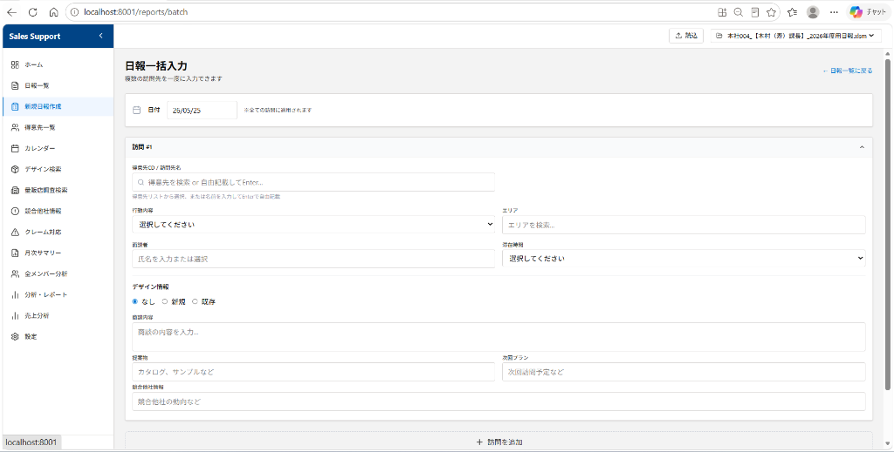
*📸 差し替え手順: `docs_images/03_report_input.png` としてスクリーンショット画像を保存してください。*

エクセルを開くことなく、直感的なWebフォームから日報を直接エクセルに追加できるメインの入力画面です。

#### 💡 入力をサポートするスマート動的フォーム:
本画面は、入力の手間をできる限り省き、間違いのない登録ができるよう、様々な支援機能を搭載しています。

* **📁 選択されているエクセルファイルの自動・常時確認（★超重要）**:
  * 画面の最上部（ヘッダー）には、現在選択されているエクセルファイルの名前が常に表示されています。
  * **「入力を始める前に、自分専用のエクセルファイルになっているか」を視覚的に一目で確認できる**ため、誤って他人のファイルに書き込んでしまうミスを未然に防ぎます。

* **📅 当日の日付の自動初期入力**:
  * 画面を開いた際、**「日付」入力欄にはあらかじめ「今日の日付（当日）」が自動的に入っています。**
  * そのため、当日の日報を書く場合は**日付を入力・変更する必要はありません。** 昨日の分を後から登録する「後日入力」などの場合のみ、枠をクリックして日付を変更してください。

1. **行動内容によるフォームの動的切り替え（自動絞り込み機能）**:
   * **得意先入力に応じた自動フィルタリング**:
     * 先に「得意先」や「訪問先名」を入力しておくことで、行動内容のプルダウン内の選択肢から「社内（半日・１日）」や「外出時間」などの関係ない項目が自動的にフィルタリング（非表示）され、選択ミスを未然に防ぐ仕組み（動的フィルタリング）になっています。
   * **「社内（半日）」「社内（１日）」「外出時間」を選択した場合**:
     * 訪問先名、面談者、滞在時間、エリア、デザイン仕様などのすべての営業用入力項目が**自動的に非表示**になり、無駄な入力を完全に省きます。
   * **「量販店調査」を選択した場合**:
     * 一括入力画面では訪問先（店舗名）がフリーテキスト入力（過去の履歴から自動サジェスト）に切り替わり、面談者やデザイン仕様などの不要な項目は非表示になります（※個別入力画面では、必要に応じて面談者等の項目を任意に入力または空欄にすることができます）。
   * **「外出時間」を選択した場合**:
     * 専用項目である**「出発時間」「帰社時間」**（30分単位の選択肢）と、**「満足度（ランク）」**（`0%`, `25%`, `50%`, `75%`, `100%` の5段階）が自動的に出現します。
     * ここで入力された時間と満足度は、保存時に「商談内容」の欄へ `【外出時間】 09:00〜18:00 【満足度】 75%` の形式で自動的にマージされ、エクセル側の集計整合性を崩さない形で美しく記録されます。

2. **エクセルの仕様に準拠した各プルダウンの選択肢一覧**:
   本システムでは、エクセルのマクロや既存ルールに適合するよう、各入力値は自由記述ではなく、規定の選択肢から選ぶプルダウン方式になっています。

   * **📂 行動内容 (13種類)**:
     ` - (選択なし) ` | ` 訪問（アポあり） ` | ` 訪問（アポなし） ` | ` 訪問（新規） ` | ` 訪問（クレーム） ` | ` 電話商談 ` | ` 電話アポ取り ` | ` メール商談 ` | ` 量販店調査 ` | ` 社内（半日） ` | ` 社内（１日） ` | ` 外出時間 ` | ` その他 `
   * **⏱️ 滞在時間**:
     ` - (選択なし) ` | ` 10分未満 ` | ` 30分未満 ` | ` 60分未満 ` | ` 60分以上 `
   * **⭐ 満足度（達成率）** (※行動内容「外出時間」の時のみ):
     ` 0% ` | ` 25% ` | ` 50% ` | ` 75% ` | ` 100% `
   * **🎨 デザイン種別**:
     ` - (選択なし) ` | ` 別注（新版） ` | ` 別注（改版） ` | ` 別注（再版） ` | ` SP（新版） `
   * **📈 デザイン進捗状況**:
     ` - (選択なし) ` | ` 新規 ` | ` 50％未満 ` | ` 80％未満 ` | ` 80％以上 ` | ` 出稿 ` | ` 不採用（コンペ負け） ` | ` 不採用（企画倒れ） ` | ` 保留 `

3. **保存と自動採番・バックアップ**:
   * 入力後に「保存する」ボタンを押すと、バックエンドでエクセルの最終行を自動検出します。
   * 適切な**管理番号**を自動で発番した上で、安全にエクセルへ書き込みします。
     > [!CAUTION]
     > **⚠️ エクセル原本を直接手動編集する場合の超重要注意（管理番号の不備・エラー仕様）**
     > 本システムは、エクセルのA列（管理番号）をスキャンして「現在登録されている最大の数値」を自動検出し、それに `+1` した番号を次の管理番号として割り当てます。エクセル原本を直接開いて手動で日報を追加・修正する際は、以下のルールを必ず厳守してください。これを破ると**既存データの消失（上書き）やシステムエラー**の原因となります。
     > 
     > 1. **管理番号（A列）を未記入（空欄）にしないでください（★致命的）**:
     >    A列が空欄の行があると、システムはその行を飛ばして「管理番号が入っている最大行」の次の行に書き込みに行きます。結果として、**手動で直接入力したデータの上にWebシステムから保存したデータが上書きされてしまい、データが永久に消失する重大なリスク**があります。
     > 2. **管理番号に文字を記入したり、連番を狂わせたりしないでください**:
     >    A列に数値以外の文字列（例: `A100` や `修正` など）を入力すると、システムが数値を読み取れず無視してしまいます。また、飛び値（例: 本来の連番が `250` なのに手動で `9999` と入力するなど）を入力すると、システムは次回から `10000` などの狂った連番を自動発番するようになり、並び替えや統計が機能しなくなります。
     > 3. **管理番号の重複を避けてください**:
     >    同じ管理番号が複数存在すると、詳細モーダルの呼び出し時や個別保存時に衝突（意図しない別の行が上書きされるなどの不具合）が発生します。手動で直接入力する場合は、必ず重複しない正しい連番を付与してください。
   * 保存の瞬間に、元のエクセルファイルと同じフォルダ内に `backup` フォルダが自動生成され、タイムスタンプ付きの複製ファイル（例：`日報_2026_20260524_160000.xlsm`）が非同期のバックグラウンド処理で安全に保存されます。万が一のPCフリーズやネットワーク瞬断が発生しても、任意の保存時点へ即座に復旧可能です。

---

### 👥 ④ 得意先一覧

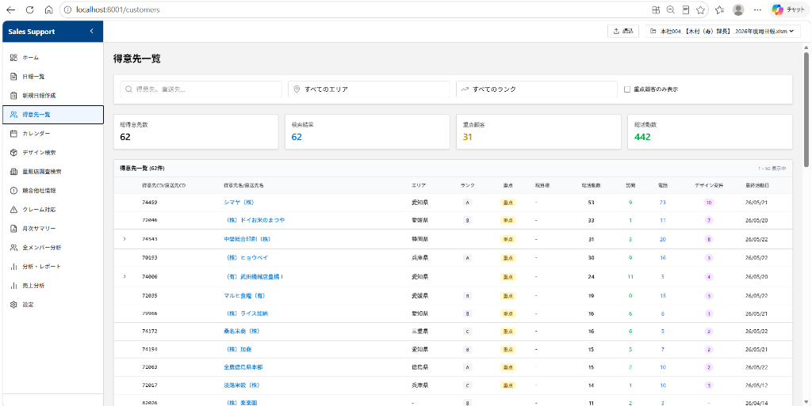
*📸 差し替え手順: `docs_images/04_customer_list.png` としてスクリーンショット画像を保存してください。*

登録されているクライアント（得意先）の基本情報や活動状況、および登録された目標（現目標）を確認・管理する画面です。

#### 🔹 主な機能と活用方法:
* **目標（現目標）とアプローチ実績の比較確認**:
  * 得意先マスタに設定された「現目標」と、実際のアプローチ回数（総活動数、訪問・電話回数など）を同じ一覧行の中で比較確認できます。
* **最終活動日の表示**:
  * 各得意先への「最終活動日」が表示されるため、訪問や連絡がしばらく滞っている顧客を視覚的にすばやく見つけ出せます。
* **多角的な絞り込み検索（エリア・ランク・重点）**:
  * 得意先名やコードによるキーワード検索に加え、**「エリア（地域別）」「ランク」「重点顧客のみ」**といった条件で瞬時に絞り込みが可能です。
* **得意先ごとの内訳（直送先）の展開表示**:
  * 得意先の行をクリックして展開することで、本社だけでなく紐付いている**「直送先（各納品先・事業所）ごとの個別のアプローチ実績」**をアコーディオン形式でその場で展開して確認できます。
* **ピンポイント活動履歴と基本情報詳細（得意先詳細画面へのアクセス）**:
  * 得意先名（または直送先名）をクリックすると、その得意先（または直送先）専用の「詳細分析・履歴画面」が開き、過去の全アプローチから売上推移までを一画面で網羅的に把握できます。
  * **📊 7つの活動統計サマリーカード**: 画面上部には、その得意先に対する「総活動数」「訪問」「電話」「デザイン案件」「クレーム」「提案物」「最終活動」の7つの重要指標が、視覚的に分かりやすい個別のカードで自動集計されて表示されます。
  * **🎯 目標（現目標）の確認**: マスタに登録された最新の目標（「現目標」）が、薄い青色のグラデーションバナーで大きく表示されます。
  * **🗂️ 目的別に一瞬で切り替えられる4つの専用タブ**:
    1. **① 活動履歴（タイムライン）**: すべての日報履歴が、訪問（緑色の人型アイコン）や電話（青色の電話アイコン）といった活動種別ごとのタイムライン形式で時系列に並びます。**「面談者プルダウン」**で特定の面談者への活動履歴だけに一瞬で絞り込むことも可能です。
    2. **② デザイン案件**: 得意先に紐づく別注やSPなどのデザイン案件がカード形式で一覧表示されます。進捗状況や種別のプルダウンによる複合絞り込みに加え、各デザイン案件に紐づく過去の具体的な活動内容が左側に縦ラインが引かれたタイムライン形式で時系列に一覧表示されます。
    3. **③ クレーム対応**: 過去の活動からクレーム（トラブル）に関連する日報だけを賢く自動抽出し、薄オレンジ色の警告ボックスでタイムライン化します。重大なトラブルの経緯と次回プランを即座にキャッチアップできます。
    4. **④ 売上データ**: アップロードされた売上実績CSVから、その得意先の**「売上順位」**と**「売上ランク」**を大きく可視化。さらに、「今期・前年（YoY比）・前々年」の**過去3年間にわたる売上高と粗利益（額）の推移**を一元把握できます。
* **営業統計サマリー**:
  * 画面上部に「総得意先数」「検索結果」「重点顧客」「総活動数」の4つの**統計サマリーカード**が表示され、担当エリア全体の活動状況を把握するのに役立ちます。

---

### 📅 ⑤ カレンダー

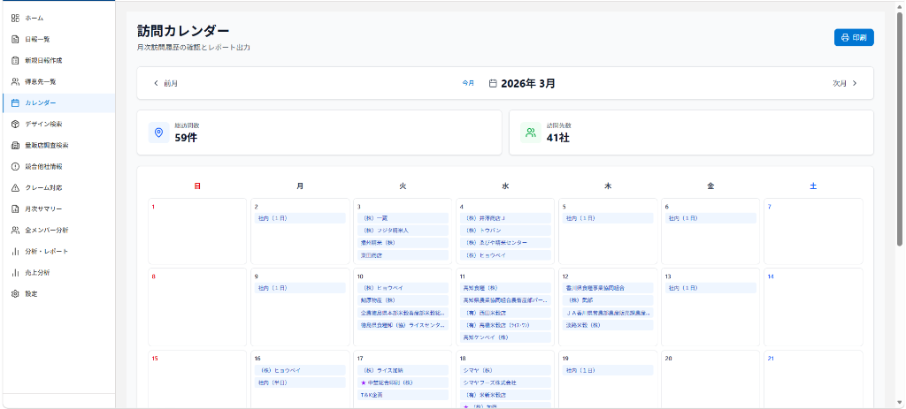
*📸 差し替え手順: `docs_images/05_calendar.png` としてスクリーンショット画像を保存してください。*

カレンダー形式で、いつ・どの得意先へ訪問、あるいはどのような社内業務を行ったかを視覚的に把握する画面です。
※営業活動の記録としては**「訪問」のみが抽出・表示され、電話やメールなどの「連絡」はカレンダー上には表示されない仕様**となっています。

#### 🔹 主な機能と活用方法:
* **月次活動履歴（訪問・社内業務）の一覧表示**:
  * 日付ごとの枠内に、その日に行われた営業活動（訪問先名）または社内業務（「社内（半日）」「社内（１日）」）が一目で分かるように自動配置されます。
  * **カレンダーの表示対象となる行動内容**:
    * 営業活動：`訪問（アポあり）` | `訪問（アポなし）` | `訪問（新規）` | `訪問（クレーム）`
    * 社内業務：`社内（半日）` | `社内（１日）`
    * ※デザイン提案を含む活動には、得意先名の頭に紫色の **`★`** マークが表示されます。
  * **⚠️ 表示対象外となる行動内容（注意）**:
    * `電話商談` | `電話アポ取り` | `メール商談` | `量販店調査` | `外出時間` | `その他` などの活動履歴はカレンダー上には表示されません（これらは日報一覧や得意先詳細のタイムライン等で確認できます）。
* **活動詳細のポップアップ確認**:
  * 得意先が表示されている日付枠をクリックすると、ポップアップ画面が開き、その日の商談内容（コメント）、面談者、滞在時間、およびデザイン詳細などの詳しい記録をその場で確認できます。
* **カレンダーの印刷・PDF出力機能**:
  * 画面右上にある「印刷」ボタンを押すことで、表示している月間訪問カレンダーをレポートとしてきれいに印刷（またはPDFとして保存）することができます。

---

### 📦 ⑥ デザイン検索

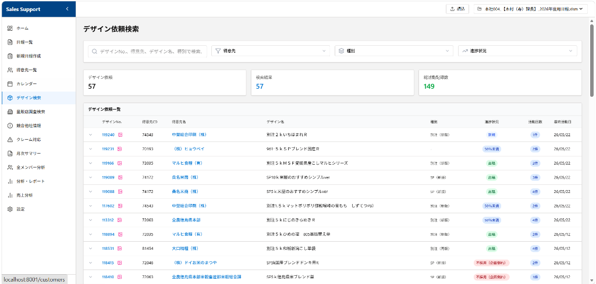
*📸 差し替え手順: `docs_images/06_design_search.png` としてスクリーンショット画像を保存してください。*

過去に蓄積されたデザイン依頼書、別注手配、SP手配などの案件情報を多角的に検索・管理する画面です。

#### 🔹 主な機能と活用方法:
* **クロスフィルター検索**:
  * 「デザインNo」「得意先名」「デザイン名」「デザイン種別」を組み合わせて複合検索できます。
* **動的フィルタリング**:
  * 特定の得意先を選ぶと、その得意先が過去に依頼した「デザイン種別」のみがプルダウンの選択肢として動的に絞り込まれます。
* **進捗ステータスバッジ**:
  * デザインの進捗状況（「新規」「50％未満」「80％未満」「80％以上」「出稿」「保留」「不採用（コンペ負け）」「不採用（企画倒れ）」）が、状況に応じて色分け（青・緑・黄・赤など）されたバッジで視覚的に表示されます。
* **タイムライン機能**:
  * デザイン依頼を選択すると、そのデザインの依頼から現在の進捗、関連する営業担当者のこれまでのアプローチ履歴が時系列カードで一覧表示されます。
* **関連デザイン画像のプレビュー（画像検索・ダウンロード）**:
  * デザインNo.の横にあるピンク色の画像アイコンをクリックすることで、そのデザインNo.に関連する画像やPDFデータを瞬時に検索し、画面上でプレビュー表示・確認が可能です（PDFデータは別タブで開くことができます）。また、表示された各ファイルのダウンロードボタンから手元に保存することも可能です。
* **ダイレクト日報追加機能**:
  * 各デザイン案件の履歴を展開した中にある「このデザインの日報を追加」ボタンをクリックすることで、得意先情報やデザインNo.、デザイン名、種別などの情報が自動で初期入力された状態で、その場で新しい日報をすばやく追加・記録できます。

---

### 🏢 ⑦ 量販店調査検索

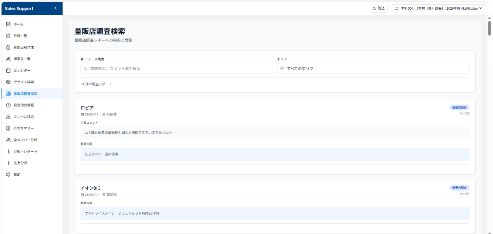
*📸 差し替え手順: `docs_images/07_survey_search.png` としてスクリーンショット画像を保存してください。*

日報の行動内容が「量販店調査」である活動データを自動的に抽出し、キーワードやエリアで検索・閲覧する画面です。

#### 🔹 主な機能と活用方法:
* **キーワード検索**:
  * 訪問先名やコメント内容などのキーワードで、過去の量販店調査レポートを瞬時に絞り込みます。
* **エリアフィルター**:
  * エリア（地域）ごとにプルダウンで絞り込みが可能です。どの地域でどのような調査を行ったかを確認できます。
* **タイムライン形式の表示**:
  * 調査結果は日付の新しい順にカード形式で一覧表示され、各カードには日付・訪問先名・エリア・担当者・商談内容が見やすくまとめられています。

---

### ⚠️ ⑧ 競合他社情報

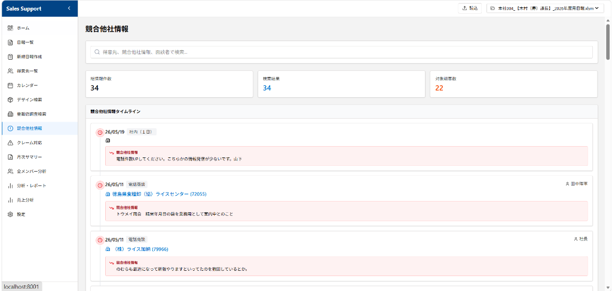
*📸 差し替え手順: `docs_images/08_competitor_info.png` としてスクリーンショット画像を保存してください。*

日報の「競合他社情報」欄に記載されたデータを自動的に抽出し、タイムライン形式で一覧検索する画面です。

#### 🔹 主な機能と活用方法:
* **自動抽出とタイムライン表示**:
  * 過去の日報データのうち、「競合他社情報」が入力されているレコードのみを自動的に抽出し、日付の新しい順にタイムラインで一覧表示します。
* **キーワード検索**:
  * 得意先名、競合他社情報の内容、面談者名でフリーワード検索が可能です。社内会議の資料作成や競合対策の検討時に確実な情報ソースとして活用できます。
* **統計サマリー**:
  * 画面上部に「総情報件数」「検索結果数」「対象顧客数」がサマリーカードで集計表示されます。

---

### 🚨 ⑨ クレーム対応

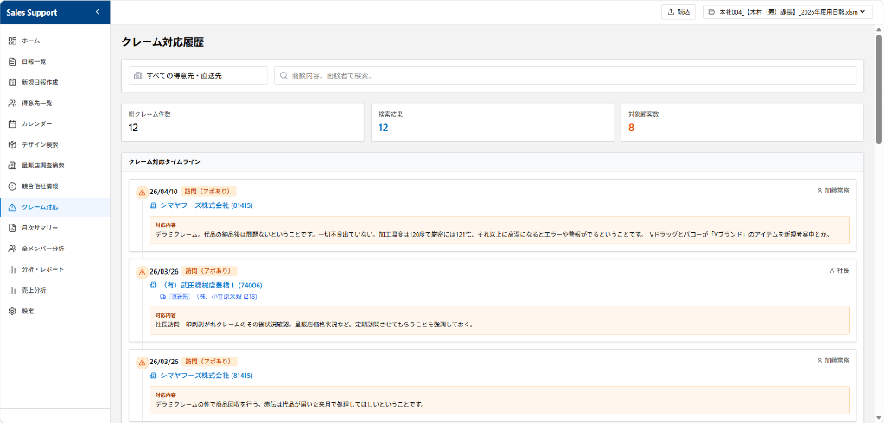
*📸 差し替え手順: `docs_images/09_claim_handling.png` としてスクリーンショット画像を保存してください。*

日報データの中から、行動内容や商談内容に「クレーム」を含む活動記録を自動的に抽出し、対応履歴をタイムライン形式で検索・閲覧する画面です。

#### 🔹 主な機能と活用方法:
* **クレーム関連データの自動抽出**:
  * 行動内容が「訪問（クレーム）」であるレコード、または商談内容に「クレーム」を含むレコードを自動的にピックアップして一覧表示します。
* **得意先・直送先フィルター**:
  * プルダウンから特定の得意先や直送先を選択して絞り込み、特定顧客に関するクレーム対応履歴のみを確認できます。
* **キーワード検索**:
  * 商談内容や面談者名で自由に検索し、過去の類似クレームへの対応方法を参考にできます。
* **統計サマリー**:
  * 「総クレーム件数」「検索結果数」「対象顧客数」がサマリーカードで集計表示されます。

---

### 📈 ⑩ 分析・レポート機能群

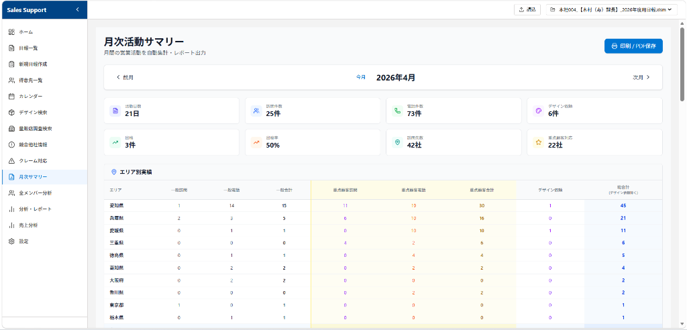
*📸 差し替え手順: `docs_images/10_analytics.png` としてスクリーンショット画像を保存してください。*

入力された日報データを自動集計し、様々な角度から営業活動の効果や売上結果をグラフ・集計表で分析する画面群です。

* **📊 月次活動サマリー (`/reports/summary`)**:
  月ごとの活動量（訪問、電話、デザイン依頼等）や重点顧客への対応状況を集計・表示し、そのまま印刷やPDF出力ができる月次レポート画面です。
* **👥 全メンバー活動分析・日報点数表 (`/analytics/members`)**:
  全営業メンバーの活動実績を点数化して目標達成率・評価点をマトリクスで表示する「日報点数表」と、指定月度の詳細な「活動集計」を行う画面です。
* **📈 営業分析ダッシュボード (`/analytics`)**:
  「全体概要」「商談分析」「デザイン分析」「重点顧客分析」の4つのタブで構成され、活動と成果の相関やエリア別分布などをグラフや表で多角的に可視化・分析します。
* **💰 売上分析 (`/sales-analysis`)**:
  全得意先の売上・粗利・前年比を一覧表示し、エリア・ランク・担当者等で絞り込んで分析する画面です。　こちらを有効にする場合は社内システム（ABS）から顧客別売上ランキング表を抽出し設定でアップロード必要です。

---

### ⚙️ ⑪ 設定

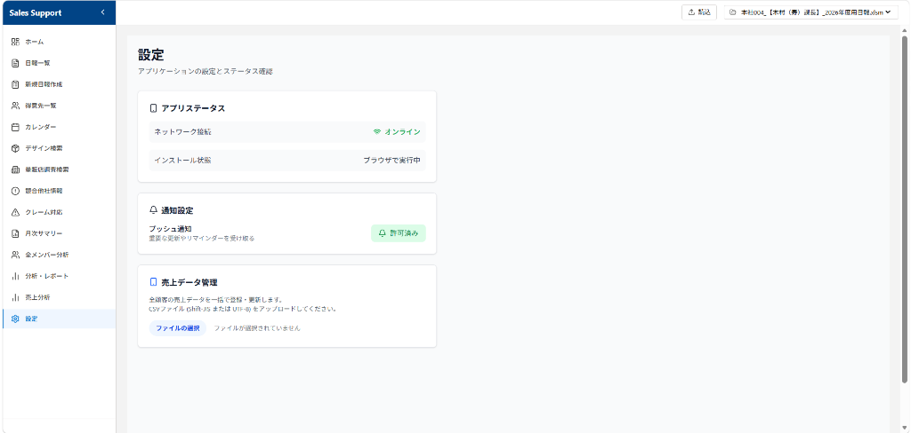
*📸 差し替え手順: `docs_images/11_settings.png` としてスクリーンショット画像を保存してください。*

アプリケーションの動作状況の確認、通知設定、および売上分析用のマスタデータ管理（CSVアップロード）を一括で行う画面です。

#### 🔹 主な機能と詳細な仕様:
* **📱 アプリステータス**:
  * **ネットワーク接続**: 現在のPCやデバイスの接続状態（オンライン/オフライン）を自動判別し、リアルタイムのアイコン（Wifiマーク）で表示します。
  * **インストール状態**: アプリが通常のインターネットブラウザで開かれているか、あるいはPWA（Progressive Web App）機能を利用してPCやデバイスにインストールされた「独立したアプリ（スタンドアロン）」として実行されているかをシステムが自動判別して表示します。
* **🔔 通知設定**:
  * **ブラウザのプッシュ通知の許可**: システムからの重要な更新やリマインダーをデスクトップ上に通知するための設定です。
  * 「通知を許可」ボタンをクリックするとブラウザの許可プロンプトが表示され、許可が与えられるとステータスが「許可済み（緑色）」へと自動的に切り替わります。
* **💰 売上データ管理 (CSVアップロード)**:
  * 得意先ごとの売上高・粗利益を「売上分析」画面に反映させるためのマスタデータ登録機能です。
  * 社内システム（ABS等）から抽出したCSVデータ（Shift-JIS / UTF-8 エンコーディングに対応）をファイル選択し、確認ダイアログで許可を与えることで、既存の売上データを一瞬で安全に上書き・更新できます。

---

### ☁️ ⑫ 【便利機能】電波がなくても大丈夫！一時保存と自動送信（SyncStatus）

出張先や移動中などで、インターネットや社内ネットワークに繋がっていない状態（オフライン）でも、日報の入力や下書き保存が可能です。

#### 🔹 初心者向け：やさしい仕組み解説
* **どこでも入力OK**: ネットに繋がっていなくても、画面からいつも通り日報を入力して「保存する」を押すことができます。
* **パソコン内に「下書き」保存**: ネットがない状態で保存すると、データは消えず、あなたのパソコンの中に安全に「下書き」として一時保存されます。このとき、画面の左下（メニューの一番下）に「☁️ オフライン (○件未送信)」と表示されます。
* **ネットに繋がると自動送信**: 会社に戻ったり、VPNに接続してインターネットがオンラインになると、システムが自動的にオンライン復帰を検知し、一時保存されていた日報を自動的にエクセル原本へ書き込み（同期）ます。
* **手動で送信したいとき**: 左下の「☁️ オフライン (○件未送信)」という文字をクリックするだけで、その場でエクセルへの送信を実行することもできます。

---

## 5. Excel連携およびデータ管理の仕様（一般ユーザー向け）

本システムは、データベース（SQL等）を使用せず、**エクセルファイルを直接データベースの代わりとして使用**します。このため、以下の安全仕様と注意点をご理解の上ご利用ください。

### 📁 データの書き込み・読み込みプロセス
1. 画面の起動や再読み込み時に、指定されたディレクトリ内のエクセルファイル（`.xlsm`）を自動検出し、ファイルに変更があれば最新の全行を自動で読み込んで表示します（高速化のため、変更がない場合はキャッシュから一瞬で読み込まれます）。
2. 新規追加や編集が行われると、バックエンド側で高速データ処理を実行し、書式やエクセル関数・マクロを保持したまま書き込みを実行します。

### 🛡️ データの破損を防ぐ安全対策とバックアップ
* **安全な保存（セーフセーブ）仕様**
  データの書き込み時、ネットワーク切断等によるファイル破損を防ぐため、一度別の一時ファイルに保存して正常性を検証してから元のファイルに置き換える「セーフセーブ」機構を採用しています。
* **自動バックアップ仕様**
  保存処理が正常に完了した直後、自動的に元のエクセルファイルがあるフォルダ内の `backup` フォルダへ、実行日時のついたバックアップファイル（例: `日報_2026_YYYYMMDD_HHMMSS.xlsm`）を自動作成します。万が一のトラブル時も、バックアップから即座に復旧可能です。
* **同時編集の競合回避（楽観的ロック）**
  同じ日報データを複数の人が同時に編集して上書きしてしまうのを防ぐため、保存時にデータの衝突を検知すると「他の方が編集しました」とエラー警告を表示し、上書きを防止します。

> [!CAUTION]
> **📢 エクセルを同時に直接開かないでください！（超重要）**
> 本システムが日報を保存する際、裏側でエクセルファイルに直接書き込みを行っています。
> そのため、**対象のエクセルファイル（例：`日報_2026.xlsm`）を、誰かが直接エクセル（Excel）のソフトで開いて作業していると、システムが書き込みできず、保存エラー（アクセス拒否）になってしまいます。**
> * 日報を登録・編集する際は、**直接エクセルファイルを開かない**ようにしてください。
> * もし直接エクセルでデータを見たい場合は、確認が終わったら**すぐにファイルを閉じる**よう、部署内でのご協力をお願いいたします。
> * ファイルが開かれていて保存できなかった場合、画面に「Excelファイルを閉じてから再度実行してください」という旨のエラーが表示されますので、ファイルを閉じた後に再度保存をお試しください。

---

## 6. お助けトラブルシューティング（症状から探す）

「いつもと違う画面になった！」「エラーが出て動かない！」というときは、慌てずに以下の症状から解決方法を見つけてください。

### ❓ 画面が真っ白、または「このページにアクセスできません」と出る
* **チェック 1：黒い画面を閉じていませんか？**
  * システムのエンジンである「黒い画面（コマンドプロンプト）」を「×」で閉じてしまうと、画面が出なくなります。
  * **対策**: もう一度 `営業日報システム起動.vbs`（または `DailyReportServer.exe`）をダブルクリックして起動し直してください。
* **チェック 2：社内ネットワーク（VPN）が切れていませんか？**
  * 会社の共有フォルダにあるエクセルにアクセスするため、社内ネットやVPNに繋がっていないと画面が開きません。
  * **対策**: パソコンが社内Wi-Fiや有線LAN、またはVPNに正しく接続されているか確認してください。

### ❓ 保存ボタンを押すと英語のエラー（Permission Error / Permission Denied）が出る
* **原因：エクセルファイルが「使用中」になっていて書き込めません。**
  * 自分、または部署の他の誰かが、対象の日報エクセルファイルを直接Excelソフトで開いたままにしている可能性が非常に高いです。
  * **対策**: エクセルファイルを開いている人は全員ファイルを閉じてください。全員が閉じた状態で、もう一度保存ボタンを押すと正常に保存されます。

### ❓ パソコンのセキュリティソフトから「安全ではない」と警告画面が出た
* **原因：会社独自で作られたシステムのため、パソコンが一時的に警戒しています。**
  * ウイルスや有害なソフトではありませんのでご安心ください。
  * **対策**: 警告画面に表示されている **「詳細情報」** という青い文字をクリックし、その後に出現する **「実行」** ボタンを押してください。次回からは警告が出なくなります。

### ❓ 入力したはずの日報が、エクセルファイルに反映されていない
* **原因：まだ「下書き（一時保存）」状態の可能性があります。**
  * インターネットに繋がっていない場所で保存した場合、データは一時的にパソコン内に保存され、まだエクセルには届いていません。
  * **対策**: 画面の左下（メニューの最下部）を確認し、`☁️ オフライン` と書かれている場合は、そこをクリックして手動送信するか、ネットが繋がる環境（社内LAN等）にPCを接続してしばらくお待ちください（自動で送信されます）。

### ❓ 「他の方が編集しました」という警告メッセージが出て保存できない
* **原因：同じ日報を他の人がほぼ同時に編集・保存しました。**
  * あなたが画面を開いてから保存ボタンを押すまでの間に、上長や他の営業担当者がその日報（同じ管理番号）を更新したため、上書きによるデータ消失を防ぐ安全装置（楽観的ロック）が動きました。
  * **対策**: 一度画面を再読み込み（リフレッシュ）して最新の状態に戻し、他の人が編集した内容を確認してから、必要に応じて再度編集・保存を行ってください。

### ❓ 得意先を選択したのに、面談者（または過去のデザイン依頼）の候補がリストに出ない
* **原因：その得意先に対して、過去に一度も面談者（またはデザイン）の登録がありません。**
  * システムは過去の入力履歴から候補を自動で探して表示しています。初めて活動する得意先の場合は候補が表示されません。
  * **対策**: 候補が表示されない場合は、直接キーボードで手入力してください。一度登録して保存すれば、次回以降は自動で候補リストに表示されるようになります。

---

## 7. システム管理者・保守開発者向け技術仕様 (Technical Reference for System Admin & Developers)

> [!WARNING]
> **⚠️ 注意**
> この章に書かれている内容は、システムの導入設定、機能改修、およびメンテナンスを行う「システム管理者」および「保守開発エンジニア」専用の技術情報です。
> **一般のユーザー様がこの設定やコードを操作・変更する必要はありません。** 誤って変更するとシステム全体が正常に起動しなくなる恐れがあります。

---

### 7.1 `config.json` の設定仕様と初期設定 (System Configuration)

社内共有のネットワークフォルダを利用して、複数名で同じ日報エクセルファイルを管理・共有する場合、システム起動前に以下の設定を必ず実行してください。

1. `DailyReportServer.exe` と同じフォルダ内にある **`config.json`** をメモ帳などのテキストエディタで開きます。
2. `"excel_dir"` の値を、社内共有フォルダ上の日報エクセルファイル（またはそのフォルダ）が保存されているディレクトリのパス（絶対パス）に書き換えます。
   * **例**: `"excel_dir": "\\Asahipack02\Shared\営業部\日報\2026年度"`
   * **💡 JSON形式の厳重注意**:
     JSON形式の仕様上、パス区切りのバックスラッシュ（`\`）はエスケープ文字として処理されるため、**必ず二重（`\`）で記述してください。** 一重で記述した場合、設定ファイルのパースエラーとなりシステムが起動しません。
3. `config.json` を保存して閉じ、改めて `DailyReportServer.exe` を起動します。

---

### 7.2 新年度（年度変更時）の切り替え手順 (Annual Rollover Process)

年度が新しくなり、日報の保存先エクセルファイルを新年度用に切り替える場合は、システム管理者が以下の手順に従って設定を行ってください。

1. **新しい年度用エクセルファイルの準備**:
   * 前年度のファイル（またはひな形テンプレートファイル）をコピーし、新しい年度の名前（例：`日報_2027.xlsm`）で共有サーバーまたはローカルに保存します。
2. **`config.json` の書き換え**:
   * システムフォルダ内の `config.json` をテキストエディタ（メモ帳など）で開きます。
   * `"excel_dir"` の値を、先ほど準備した新しいファイルが保存されているディレクトリのパスに書き換えます。
     * **例（2026年度から2027年度への変更）**:
       ```json
       "excel_dir": "\\Asahipack02\社内書類ｎｅｗ\01：部署別　営業部\02：営業日報\2027年度"
       ```
     * ※バックスラッシュ（`\`）は必ず二重（`\`）で記述してください。
3. **システムの再起動**:
   * すでに起動している場合は、ブラウザと `DailyReportServer.exe`（黒い画面）を一度完全に閉じます。
   * 改めて `DailyReportServer.exe`（または起動用ショートカット）を起動します。
   * ダッシュボード画面の上部に表示される「アクティブファイル」が新しい年度のファイルパスに切り替わっていれば、設定完了です。

---

### 7.3 アーキテクチャおよびデータフロー概要 (System Architecture & Dataflow)

本システムは、軽量性と配布の容易さを最大化するため、**Next.jsの静的エクスポート機能 (SSG/SPA) と、FastAPIによるローカルWebサーバー**を組み合わせたハイブリッド構成を採用しています。

```mermaid
graph TD
    subgraph Client [クライアント環境 (ブラウザ)]
        UI[React / Next.js SPA] <-->|REST API (JSON)| API[FastAPI Server]
    end
    
    subgraph Server [ローカル実行環境 (DailyReportServer.exe)]
        API <-->|openpyxl / pandas| Excel[(Excel擬似DB .xlsm)]
        API -.->|BackgroundTasks| Backup[(自動バックアップ /backup)]
        API -.->|ディスクキャッシュ| Cache[(ディスクキャッシュ .cache/*.pkl)]
    end
```

#### 📦 配布パッケージ (`DailyReportServer.exe`) の内部動作原理
PyInstaller を使用し,Python環境（FastAPI, pandas, openpyxl等）とビルド済みのフロントエンド静的資産（`static/` フォルダ）を単一の実行可能ファイル（EXE）に同梱しています。
* **ベースパスの動的解決 (`sys.frozen` のハンドリング)**:
  * **外部読み込みパス (Config/Log等)**: `DailyReportServer.exe` と同一階層にある `config.json` や `server_debug.log` のパスは、`sys.executable` (実行ファイルのパス) を基準に解決されます (`backend/main.py` 内の `get_base_path()` を参照)。
  * **内部バンドルパス (Static/Assets等)**: PyInstallerが起動時にテンポラリフォルダ（`_MEIPASS`）に展開する静的ファイルは、`sys._MEIPASS` を基準に解決されます (`get_bundle_path()` を参照)。これによって、開発環境（ソース起動）と本番環境（EXE起動）の両方でシームレスなパス解決を実現しています。

---

### 7.4 Excel擬似データベースの制御仕様 (Excel Database Engine & Cache System)

本システムは、リレーショナルデータベース（RDB）を導入せず、既存のExcelファイル（`.xlsm`）をデータストレージとしてダイレクトに読み書きする構造を持っています。

#### ⚡ マルチレイヤ・キャッシュ機構 (Cache Invalidation Logic)
動作が重くなりがちなネットワーク共有フォルダ上のExcel読み込みを高速化するため、**メモリ (In-Memory)** と **ディスク (Disk)** の2層キャッシュ機構を実装しています。

1. **タイムスタンプ自動監視 (`st_mtime` による判定)**:
   APIリクエスト時にExcelファイル（`日報_2026.xlsm` 等）の最終更新日時（`os.path.getmtime()`）を毎回ミリ秒単位で取得し、キャッシュの有効性をチェックします。
2. **メモリキャッシュ (`CACHE` 辞書)**:
   FastAPI起動中、一度読み込んだデータフレームを `CACHE` グローバル辞書に保持。タイムスタンプが一致する限り、メモリから即座にコピーを返します。
3. **ディスクキャッシュ (`backend/.cache/`)**:
   メモリから溢れた場合やアプリ再起動時に備え、シートごとに一意のハッシュキー（`hashlib.md5(f"{filename}_{sheet_name}".encode('utf-8')).hexdigest()`）を生成し、`pickle` 形式でシリアライズ保存しています。
4. **キャッシュ破棄 (Invalidation)**:
   日報の追加・更新・削除APIが正常に完了した直後、該当ファイルのキャッシュキーをメモリおよびディスクから即座に破棄（`del CACHE[cache_key]`）し、次回のデータ整合性を完全に担保します。

#### 🔒 楽観的同時実行制御 (Optimistic Concurrency Control)
複数メンバーが同じ共有Excelに日報を保存する際のデータ先祖返りを防ぐため、**「楽観的ロック」**を実装しています。
* `update_report()` 内で、クライアント側が編集開始時に保持していた `original_values`（上長コメント、返信欄、商談内容など）と、保存直前にExcelから直接ロードしたセルの値を比較。
* 万が一、編集中に他のユーザーによって該当セルが変更されていた場合は、`409 Conflict` エラーを発生させ、強制上書きを防ぎます。

#### 🔑 ファイルロック競合への対処
他のユーザーが直接Excelソフトでファイルを開いていて編集ロックがかかっている場合、Pythonの `openpyxl` による `wb.save()` 実行時に `PermissionError` が発生します。
* システムはこの例外を適切にキャッチし、クライアントへ `409 Conflict` (エラーメッセージ: `"ファイルが開かれているため保存できません。Excelファイルを閉じてから再度実行してください。"`) を返してデータ入力内容が消失しないように保護します。

#### 📅 自動非同期バックアップ (Asynchronous Backup System)
保存処理のオーバーヘッドを削減し、UIの応答性を保つため、Excelの保存直後に FastAPI の `BackgroundTasks` を使用して、バックアップコピー（`/backup` サブフォルダ内へのタイムスタンプ付き保存）を非同期実行します。

---

### 7.5 営業日報シートおよび得意先シートの物理レイアウト (Physical Excel Schema)

本システムは、Excel原本の物理レイアウトに強く依存しています。各項目の列位置は `backend/main.py` の `columns_to_write` マッピング辞書内にインデックス番号（1-indexed）でハードコーディングされています。

#### 📊 「営業日報」シート カラム構造定義
| 列 (英名) | インデックス (1-indexed) | フィールド名 | FastAPI Pydantic対応モデル属性 |
| :--- | :---: | :--- | :--- |
| **A列** | 1 | 管理番号 (PK) | `management_number` (新規追加時は自動最大値+1) |
| **B列** | 2 | 日付 | `日付` (YYYY-MM-DD 形式) |
| **C列** | 3 | 行動内容 | `行動内容` |
| **D列** | 4 | エリア | `エリア` |
| **E列** | 5 | 得意先CD. | `得意先CD` |
| **F列** | 6 | 直送先CD. | `直送先CD` |
| **G列** | 7 | 訪問先名/得意先名 | `訪問先名` |
| **H列** | 8 | 直送先名 | `直送先名` |
| **I列** | 9 | 重点顧客 | `重点顧客` |
| **J列** | 10 | ランク | `ランク` |
| **K列** | 11 | 得意先目標 | (※得意先マスタ `得意先_List` のJ列より読み取り専用マッピング) |
| **L列** | 12 | 面談者 | `面談者` |
| **M列** | 13 | 滞在時間 | `滞在時間` |
| **N列** | 14 | デザイン提案有無 | `デザイン提案有無` |
| **O列** | 15 | デザイン種別 | `デザイン種別` |
| **P列** | 16 | デザイン名 | `デザイン名` |
| **Q列** | 17 | デザイン進捗状況 | `デザイン進捗状況` |
| **R列** | 18 | デザイン依頼No. | `デザイン依頼No` |
| **S列** | 19 | 商談内容 | `商談内容` (※外出時間選択時は時間・満足度がマージされます) |
| **T列** | 20 | 提案物 | `提案物` |
| **U列** | 21 | 次回プラン | `次回プラン` |
| **V列** | 22 | 競合他社情報 | `競合他社情報` |
| **W列** | 23 | コメント | `上長コメント` |
| **X列** | 24 | コメント返信欄 | `コメント返信欄` |
| **Y列〜AC列**| 25〜29 | 承認チェック欄 | (承認操作時のみフラグ更新。上長、常務、既読チェック等) |

#### 🏢 「得意先_List」シートからの目標マッピング
新規日報追加（`add_report`）時に、`得意先CD` と `直送先CD` をキーにして `得意先_List` シート（A列:得意先CD, B列:直送先CD）を走査し、一致した行の<strong>J列（10列目）「現目標」</strong>を自動抽出し、日報側のK列へ書き込むロジックが組み込まれています。

> [!CAUTION]
> **📢 スキーマ変更時（列の増減・並べ替え）の厳重注意**
> Excel原本の列を挿入・削除・移動する場合、`backend/main.py` の `add_report()` および `update_report()` 内に定義された `columns_to_write` マッピングインデックスを**完全に一致するよう修正し、EXEファイルを再ビルドする**必要があります。これを行わずにExcel原本の構造だけを修正すると、意図しない列にデータが書き込まれ、数式やデータ破損の原因となります。

---

### 7.6 デバッグおよび開発環境の個別起動手順 (Development & Debugging Setup)

ソースコードのデバッグや機能拡張を行う開発者向け環境構築および起動手順です。

#### 📋 推奨前提要件
* **Node.js**: v18.0.0 以上
* **Python**: 3.10 以上
* **パッケージマネージャー**: `npm` (frontend) / `pip` (backend)

#### 🚀 起動手順

1. **バックエンドサーバーの起動 (Port: 8001)**:
   ```powershell
   cd backend
   pip install -r requirements.txt
   python main.py
   ```
   * *※FastAPIサーバーが起動し、`http://localhost:8001` でAPIサービスがリスン状態になります。*
2. **フロントエンド開発サーバーの起動 (Port: 3000)**:
   ```powershell
   cd frontend
   npm install
   npm run dev
   ```
   * *※Next.js開発サーバーが立ち上がり、`http://localhost:3000` でUIプレビューが可能になります（CORS設定によりローカル開発時は自動的に 8001番ポートのAPIへフォワードされます）。*

---

### 7.7 配布用EXEのビルド・パッケージング手順 (Build & Packaging Flow)

ソースコードの修正後,ユーザーへ配布するための単一EXEファイル (`DailyReportServer.exe`) を生成するプロセスです。

#### 1. フロントエンドのビルド (静的HTML出力)
Next.js アプリケーションをスタンドアロンのシングルページアプリケーション (SPA) としてビルドします。
```powershell
cd frontend
npm run build
```
* ※ビルドが正常に完了すると、`frontend/out` ディレクトリに HTML, CSS, JavaScript の静的ファイルが出力されます。

#### 2. 静的ファイルのバックエンド配置
FastAPI がローカルで静的アセットをマウントして配信できるように、出力されたファイルをバックエンド配下へコピーします。
1. プロジェクトルートの `static` フォルダの中身を一度空にします。
2. `frontend/out` フォルダ内のすべてのファイル・フォルダを、プロジェクトルートの `static` フォルダへそのまま上書きコピーします。

#### 3. PyInstaller によるワンライナーパッケージング
FastAPIサーバーと静的資産フォルダ（`static/`）を単一の実行可能ファイルにまとめます。
```powershell
# 事前に `pip install pyinstaller` を実行してください
pyinstaller DailyReportServer.spec
```
* **成果物**: ビルドが完了すると、プロジェクトルートの `dist/DailyReportServer.exe` に新しい実行ファイルが作成されます。このEXEファイルのみを圧縮等で営業ユーザーへ配布してください。

---

### 7.8 トラブルシューティングおよびログ調査手順 (Troubleshooting & Logging)

本システムは標準の `logging` モジュールを使用し、リアルタイムでの障害解析が可能です。

* **ログファイルの格納場所**:
  `DailyReportServer.exe` を起動して実行したディレクトリ（通常はEXEファイルと同じ場所）に、**`server_debug.log`** というファイル名で自動生成されます。
* **主要なエラーキーワードとデバッグの着眼点**:
  * `PermissionError`: 誰かがExcelを開いているための保存ブロック。ファイルが排他ロックされていないか確認を促してください。
  * `HTTPException: 409`: 楽観的ロックの衝突。同時編集された差分箇所を確認し、クライアント側のキャッシュをクリア（リフレッシュ）させてください。
  * `UnicodeDecodeError` / `KeyError`: Excel原本のシート構造や列名が勝手に変更された、あるいはCSVマスタのエンコーディング（ABS出力のShift-JIS）が不一致の可能性があります。