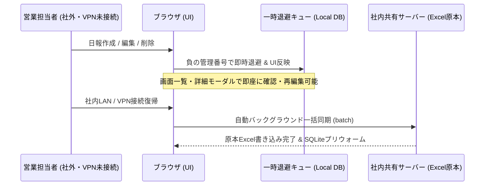

# 営業日報システム (Daily Report System) 詳細取扱説明書

> **最新バージョン**: `v2.5.12` （2026年9月最新版）  
> **対応環境**: Windows 10 / 11 (64bit) | Google Chrome / Microsoft Edge / 各種モダンブラウザ

本マニュアルは、エクセルベースの営業日報をモダンなWebインターフェースで効率的に管理・分析するための「営業日報システム」の導入・操作・保守に関する詳細な取扱説明書です。PCの操作に不慣れな一般ユーザー様からシステム管理者様まで、全員が迷わず安心して使用できるように構成されています。

---

## 🧭 目次

* [🔰 PCが苦手な方向け：かんたん1分スタートガイド](#-pcが苦手な方向けかんたん1分スタートガイド)
* [1. システム概要と特徴](#1-システム概要と特徴)
* [2. 動作環境と事前準備](#2-動作環境と事前準備)
* [3. システム起動・セットアップ方法（一般ユーザー向け）](#3-システム起動セットアップ方法一般ユーザー向け)
* [4. 各画面の構成と操作マニュアル](#4-各画面の構成と操作マニュアル)
  * [① ホーム（ダッシュボード）＆ 自動アップデート通知・ファイル再取得](#-①-ホームダッシュボード--自動アップデート通知ファイル再取得)
  * [② 日報一覧（上長コメント既読チェック可視化＆詳細モーダル）](#-②-日報一覧上長コメント既読チェック可視化詳細モーダル)
  * [③ 新規日報入力（直送先入力・一括高速保存・キーボード快適入力）](#-③-新規日報入力直送先入力一括高速保存キーボード快適入力)
  * [④ 得意先一覧・詳細（直送先分離＆4つの専用タブ）](#-④-得意先一覧詳細直送先分離4つの専用タブ)
  * [⑤ カレンダー（商談内容の展開制御＆日報詳細連携）](#-⑤-カレンダー商談内容の展開制御日報詳細連携)
  * [⑥ デザイン進捗・検索（PDF履歴タブ閲覧＆直送先自動引き継ぎ）](#-⑥-デザイン進捗検索pdf履歴タブ閲覧直送先自動引き継ぎ)
  * [⑦ 量販店調査検索](#-⑦-量販店調査検索)
  * [⑧ 競合他社情報](#-⑧-競合他社情報)
  * [⑨ クレーム対応](#-⑨-クレーム対応)
  * [⑩ 分析・レポート機能群（200点ペースメーカー＆重点顧客アラート連動起票）](#-⑩-分析レポート機能群200点ペースメーカー重点顧客アラート連動起票)
  * [⑪ 設定](#-⑪-設定)
  * [⑫ 【便利機能】一時退避キューと自動再同期（オフライン・社外作業の完全シームレス化）](#-⑫-便利機能一時退避キューと自動再同期オフライン社外作業の完全シームレス化)
* [5. Excel連携およびデータ管理の仕様（一般ユーザー向け）](#5-excel連携およびデータ管理の仕様一般ユーザー向け)
* [6. お助けトラブルシューティング（症状から探す）](#6-お助けトラブルシューティング症状から探す)
* [7. システム管理者・保守開発者向け技術仕様](#7-システム管理者保守開発者向け技術仕様)

---

## 🔰 PCが苦手な方向け：かんたん1分スタートガイド

「パソコンの操作が少し苦手...」「難しい用語や設定はよく分からない...」という方は、**まずここだけ読めば今日からすぐに日報システムを使えます！**

### 🌸 今日から使える！かんたん3ステップ

#### 1. 【ステップ 1】起動する（カチカチと2回押すだけ）
1. 配布されたフォルダ内にある **`DailyReportServer.exe`** をダブルクリック（カチカチと2回左クリック）します。
   
2. 自動的に黒い画面（コマンドプロンプト）が立ち上がり、進捗ログが表示されてシステムサーバーが起動します。
   
3. 自動的にインターネットブラウザが立ち上がり、日報システムの画面が表示されます。
   
   * ※もし自動で開かない場合は、ブラウザ（Google Chromeなど）を開き、アドレスバーに **`http://localhost:8001`** と入力してEnterキーを押してください。
   * **⚠️ 安心してください**: `DailyReportServer.exe` を起動すると、英語の文字が並んだ「黒い画面」が開きますが、ウイルスや故障ではありません。システムが正常に動いている証拠ですので、そのまま数秒お待ちください。
   * **💡 黒い画面（コマンドプロンプト）は閉じないで**: この黒い画面は「システムが裏側でがんばって動いている印」です。**絶対に「×」ボタンで閉じないでください。** 邪魔な場合は、画面右上にある「ー」（最小化）ボタンを押して、画面の一番下に隠しておいてください。

#### 2. 【ステップ 2】日報を入力する（手取り足取り解説！）

> [!IMPORTANT]
> **⚠️ 入力を始める前の超重要チェック！**
> 必ず最初に、画面上部に表示されているファイル名が**「自分専用のエクセル（例：日報_自分の名前.xlsm）」になっていることを確認**してください。別人のファイル名になっていると、間違って他人のデータに書き込まれてしまいます！

1. **最初に自分のエクセルになっているか確認する（★超重要！）**:
   * 画面の最上部を確認し、**現在選択されているエクセルファイルの名前が「自分専用のエクセル（例：日報_自分の名前.xlsm）」になっていることを必ず確認してください。**
   * ※もし別人のファイル名が表示されている場合は、間違って別のファイルに書き込まれてしまいます。その場合は、ヘッダーのファイル切り替えプルダウンから正しいファイルを選び直してください。共有フォルダの最新ファイルを再スキャンしたいときは、右側の **「↻（再取得）」ボタン** を押します。
   
2. **「新規日報入力」の画面を開く**:
   * 画面の左側にあるメニューの中から、**「📝 新規日報作成」**（画面上では「日報一括入力」）と書かれた文字を1回クリックします。
   
3. **日付を確認・変更する**:
   * **「日付」** の白い枠には、最初から **「今日の日付（当日）」が自動的に入っています。**
   * そのため、当日の日報を書く場合は**何もしなくて大丈夫です。**
   * ※昨日の日報を後から書くなど、「後日入力」をする場合だけ、枠をクリックして日付を変更してください。（枠の右側のカレンダーマークを押して日付を選ぶと簡単です）。
4. **活動した「得意先」と「直送先」を入力する**:
   * **「得意先CD / 得意先名」** の入力欄に、取引先の名前やコードをキーボードで入力します。
   * 文字を入れると、**データベース（エクセルファイル）から自動的に探し出して候補リストを表示してくれます。**
   * **⌨️ キーボードだけで快速入力**: キーボードの上下矢印キー（`↓` / `↑`）で候補を選び、`Enter` または `Tab` キーを押すだけで即座に確定し、次の項目へスムーズにフォーカスが移動します！
   * **💡 リストにない場合**: 新しい取引先など候補リストにない場合は、そのままキーボードで名前を入力し、`Enter` キーを押すことで自由に入力できます。
   * **🚚 直送先がある場合**: 納品先や支店などの直送先がある場合は、右隣の「直送先CD / 直送先名（任意）」欄も同様に入力または候補選択します（企画課ビューアやデザイン検索から連携した場合は自動入力されます）。
   * ※「社内（半日・１日）」や「量販店調査」、「外出時間」を登録したい場合は、この得意先欄は空欄のままにして次のステップへ進みます。
   
5. **「行動内容」と「エリア」を選ぶ**:
   * **「行動内容」** のプルダウンをクリックし、当てはまるものを1つ選びます。
     * 選択肢: `-` (選択なし), `訪問（アポあり）`, `訪問（アポなし）`, `訪問（新規）`, `訪問（クレーム）`, `電話商談`, `電話アポ取り`, `メール商談`, `量販店調査`, `社内（半日）`, `社内（１日）`, `外出時間`, `その他`
     * **💡 自動絞り込み機能**: 得意先が入力されていると、プルダウンの中から「社内（半日）」や「外出時間」などの関係のない選択肢が**自動的に非表示**になり、訪問や電話などの必要な選択肢だけがスッキリと残ります。
     * ※得意先を入力せずに「外出時間」を選んだ場合のみ、専用の「外出活動時間（30分刻み）」と「満足度（0%〜100%）」を入力する枠が自動的に出現します。
   * 行動内容を選択後、その右側にある **「エリア」** 欄をクリックして、担当エリアを選択します（得意先マスタに登録されている場合は自動入力されます）。
   
6. **面談者、滞在時間を書く**:
   * **「面談者」** の枠に会った人の名前を書き、**「滞在時間」** も必要に応じて以下から選びます。
     * 滞在時間の選択肢: `-` (選択なし), `10分未満`, `30分未満`, `60分未満`, `60分以上`
   
7. **デザインに関係する仕事をした場合（必要に応じて）**:
   * デザイン提案欄のラジオボタンから「新規」または「既存」を選びます。
   * **「新規」を選んだ場合**は、以下の項目を入力・選択します:
     * **デザイン依頼No.**: デザイン案件を管理するための依頼番号をテキストで入力します。
     * **デザイン種別**: プルダウンから `-` (選択なし), `別注（新版）`, `別注（改版）`, `別注（再版）`, `SP（新版）` のいずれかを選びます。
     * **デザイン名**: そのデザイン案件の具体的な名前や内容をテキストで入力します。
     * **デザイン進捗状況**: プルダウンから `-` (選択なし), `新規`, `50％未満`, `80％未満`, `80％以上`, `出稿`, `不採用（コンペ負け）`, `不採用（企画倒れ）`, `保留` のいずれかを選びます。
   * **「既存」を選んだ場合**は、プルダウンから対象のデザインを選択します（選択後も必要に応じて名称や種別を手動で自由に変更できます）。
   * ※デザインのやり取りがない場合は、ラジオボタン「なし」のままで大丈夫です。
   
8. **「商談内容」や提案物、次回プランを書く**:
   * **「商談内容」** の広い枠をクリックし、その日の商談の様子や活動内容をキーボードで自由に書き込みます。
   * **「提案物」** や **「次回プラン」**、**「競合他社情報」** がある場合も、それぞれの枠をクリックして入力します。
   
9. **「一括保存」ボタンを押す（複数件を一度に保存可能！）**:
   * 訪問が複数件ある場合は、下部の **「＋ 訪問を追加」** を押して何件でも入力できます。
   * すべて入力し終えたら、画面右下の **「💾 一括保存 (○件)」** ボタンを1回クリックします。
   * **🚀 v2.5.12 高速一括保存**: 複数件の日報も1回のファイルオープンで一括追記されるため、一瞬で保存が完了し、ファイルロック競合も発生しません。
   * ※万が一社内サーバーに接続できない環境やオフラインの場合でも、エラーで消えることはなく**「ローカルに安全一時保存しました」**と自動退避されますので安心です。
   
10. **「保存しました！」を確認する**:
    * 画面の上部に **「○件の日報を保存しました」** と書かれた緑色のトーストメッセージが表示されたら、無事にエクセルへ書き込まれました。これで今日の入力は完了です！
    

#### 3. 【ステップ 3】終わる（閉じるだけ）
1. 入力が終わったら、インターネットの画面（ブラウザ）を「×」ボタンで閉じて終了して構いません。
2. もし【ステップ1】で黒い画面（コマンドプロンプト）がデスクトップ上に残っている場合は、最後にその黒い画面の「×」ボタンを押して閉じてください。これで完全に終了します。

---

## 1. システム概要と特徴

本システムは、従来のエクセル（`.xlsm`）による日報管理の良さ（関数やマクロ、ネットワーク共有による管理）をそのまま活かしつつ、入力作業のストレスを軽減し、データの検索・分析能力を大幅に強化したハイブリッド型業務システムです。

```mermaid
graph TD
    User([ユーザー]) <-->|ブラウザ (モダンWeb UI)| Frontend[フロントエンド画面: Next.js 16 SPA]
    Frontend <-->|REST API (高速バッチ対応)| BackendExe[バックエンド実行ファイル: DailyReportServer.exe]
    BackendExe <-->|高速一括書き込み| ExcelFile[(共有エクセル原本 .xlsm)]
    BackendExe -->|SQLite シャドウキャッシュ| ShadowDB[(SQLite キャッシュ DB)]
    BackendExe -->|非同期自動実行| Backup[(世代管理バックアップ backup/)]
```

### ✨ 主な特徴とメリット
* **既存エクセルの完全再利用**: エクセル内に書き込まれた関数やマクロ、書式を壊すことなく、Web画面から直接データの読み書きを行います。直前の行からセル書式（フォント・色・罫線・表示形式）を自動コピーして追記するため、見た目の統一性も完璧に維持されます。
* **一括保存（バッチ保存）の高速化とファイルロック競合解消 (v2.5.9〜)**: 複数件の日報を1回のエクセルオープンで全件一括保存する最適化を導入。処理速度の劇的な向上とともに、ファイルロック競合を根絶しました。
* **オフライン・社外作業の完全シームレス化 (v2.5.0〜)**: 社内サーバー未接続時でも日報の新規作成・再編集・削除・詳細閲覧が自由に行え、社内復帰時に自動で原本へ安全マージされます。
* **キーボード操作の完全対応**: サジェスト候補の上下矢印キー選択、Tab/Enterキーでの確定＆次項目フォーカス移動に対応し、マウスレスで素早く入力できます。

---

## 2. 動作環境と事前準備

本システムを利用するにあたり、以下の環境および準備が必要です。

### 💻 クライアントPC環境
* **OS**: Windows 10 / 11 (64bit)
* **ブラウザ**: モダンなWebブラウザ (Google Chrome, Microsoft Edge 推奨)
* **ネットワーク**: 社内LAN環境（または社外からのVPN接続環境）
  * 共有フォルダ上のエクセルファイル（`\\Asahipack02` 等）に直接読み書きを行うため、対象の共有サーバーにアクセスできる状態である必要があります。

### 🔑 動作のための前提条件・事前確認
* **エクセル（Microsoft Excel）インストール不要**:
  * 本システムは内部で直接エクセルファイルを高速制御（FastAPI + pandas + openpyxl）しているため、**クライアントPCにMicrosoft Excelのソフト本体がインストールされていなくてもシステムは完璧に動作します。**
* **共有フォルダへのアクセス権限（読み書き権限）**:
  * ご利用のWindowsユーザーアカウントに、対象のネットワーク共有フォルダに対する「読み取り」および「書き込み」のアクセス権限が必要です。
* **空きポートの確保（ポート: `8001`）**:
  * システムサーバーである `DailyReportServer.exe` は、PC内でローカルWebサーバー（ポート: `8001`）を立ち上げます。二重起動した場合は自動検知して既存プロセスを尊重します。

---

## 3. システム起動・セットアップ方法（一般ユーザー向け）

### 🚀 推奨の起動方法
1. システムフォルダ内にある **`DailyReportServer.exe`**（または `営業日報システム起動.vbs`）をダブルクリックして実行します。
2. 黒いコマンドプロンプト画面が立ち上がり、自動的にシステムサーバーが起動します。
3. 自動的にインターネットブラウザが立ち上がり、日報システムの画面が表示されます。
   * ※もし自動で開かない場合は、ブラウザを開き、アドレスバーに **`http://localhost:8001`** と入力してアクセスしてください。

> [!IMPORTANT]
> **🤖 黒い画面（コマンドプロンプト）に関する超重要なお願い**
> * `DailyReportServer.exe` を起動した際に表示される黒い画面は、システムの裏側で働くエンジンです。
> * **システムを使用している間は、絶対にこの黒い画面を「×」ボタンで閉じないでください！**
> * 画面が邪魔なときは、右上にある「ー」（最小化）ボタンを押して、画面の一番下に隠してお使いください。

---

## 4. 各画面の構成と操作マニュアル

本システムは、左側のナビゲーションメニュー（サイドバー）から各機能へ簡単にアクセスできます。

---

### 📊 ① ホーム（ダッシュボード）＆ 自動アップデート通知・ファイル再取得


起動後に最初に表示される、全体の活動状況の「見える化」を行う画面です。

#### 🔹 主な機能と活用方法:
1. **担当者切り替え即時画面同期 ＆ ファイル再取得ボタン (v2.5.9〜)**:
   * 画面最上部（ヘッダー）のプルダウンから別のエクセルファイルを選ぶと、全画面のデータが瞬時に最新状態へ再取得・同期されます。
   * プルダウン左隣の **「↻（再取得）」ボタン** を押すと、共有サーバー上の最新ファイルを即座に再スキャンしてキャッシュを更新できます。
2. **新バージョン自動検知とアップデート通知バナー**:
   * 社内共有サーバー上に新しいバージョン（例：`v2.5.12`）が公開されると、画面上部に青色の通知バナーが自動表示されます。
   * **「今すぐ更新」** ボタンを押すだけで、自動ダウンロード・安全なファイル置換・再起動が行われ、ブラウザが最新版へと自動復帰します。
3. **新着上長コメントの通知・確認**:
   * エクセル内に未読の上長コメントがある場合、画面上部に赤色の目立つ枠で自動通知され、その場で「返信」や「既読」を行えます。
4. **未入力デザイン依頼の自動整理バナー**:
   * デザイン提案後、まだ日報が書かれていない依頼案件を重複なく自動リストアップします。クリック1つで情報が引き継がれた日報作成画面へ遷移できます。
5. **活動サマリーカード & 月次活動実績推移グラフ**:
   * 今月の「総日報数」「訪問件数」「電話連絡数」の合計値や推移グラフ、重点顧客状況を一目で把握できます。

---

### 📋 ② 日報一覧（上長コメント既読チェック可視化＆詳細モーダル）


過去に登録された日報を、一覧表形式または時系列カードで閲覧・検索・編集する画面です。

#### 🔹 主な機能と詳細な活用方法:
1. **選べる表示モード（テーブル表示 / タイムライン表示）**:
   * **📊 テーブル表示**: 管理番号、日付、訪問先、直送先、行動内容、面談者がコンパクトに並ぶ表形式。
   * **⏳ タイムライン表示**: 商談内容、次回プラン、デザイン進捗、上長コメントがスクロールで一発で見渡せるカード形式。
2. **上長コメント枠の既読チェック状態可視化 (v2.5.7〜v2.5.8)**:
   * タイムライン（標準・コンパクト・詳細）およびテーブルビューの上長コメント表示枠内に、既読チェック済みの場合は **「✓ 既読チェック済」バッジ** とエメラルドグリーンのアクセントが表示され、指導内容が確認済みかどうか一目で分かります。
3. **クイックリフレッシュとソート・ページネーション**:
   * 新しい順・古い順のソート切り替え、50件ごとの高速ページネーション、右上の矢印ボタンによる最新データ即時再取得に対応。
4. **日報詳細モーダル（連続確認・コメント返信・承認スタンプ）**:
   * テーブル行やカードをクリックすると詳細モーダルがポップアップします。
   * **「前へ」「次へ」ボタン**: モーダルを開いたまま連続で前後の日報をサクサク閲覧。
   * **コメント返信**: 一般営業担当者はその場で「コメント返信欄」に入力して保存可能。
   * **承認チェックボックス**: 役職者（上長、中野次長、岡本常務、山澄常務、既読チェック）はワンクリックで承認スタンプをトグル保存できます。

---

### 📝 ③ 新規日報入力（直送先入力・一括高速保存・キーボード快適入力）


直感的なWebフォームから日報を直接エクセルに追加できるメインの入力画面です。

#### 🔹 主な機能と入力支援:
1. **直送先CD / 直送先名（任意）入力欄の新設 (v2.5.9〜v2.5.12)**:
   * 得意先名の右側に「直送先CD / 直送先名」の入力欄を新設。納品先や工場などの事業所がある場合も、サジェスト選択または自由入力で正確に記録できます。
   * デザイン検索や企画課ビューアから起票した際は、依頼データ内の直送先が初期値として自動反映されます。
2. **キーボード操作の完全対応 (v2.5.9〜)**:
   * 得意先・直送先のサジェスト入力欄で、キーボードの上下矢印キー（`↓` / `↑`）で候補をハイライト選択し、`Tab` または `Enter` キーで確定＆次項目へ自動フォーカス移動。マウス操作なしで快適に入力が完了します。
3. **日報一括保存の高速化とファイルロック競合解消 (v2.5.9〜)**:
   * `POST /api/reports/batch` 最適化により、複数件の訪問データを1回のエクセルオープンで全件一括追記。保存速度が劇的に向上し、Windowsのファイルロック待ちによるタイムアウトを根絶しました。
4. **安心のステータス通知とオフライン自動一時保存**:
   * 一括保存完了時には「〇件の日報を一括保存しました」と安心できるトーストを表示。万が一社内サーバー未接続時でも「ローカルに安全一時保存しました」とブラウザストレージへ自動退避されます。
5. **行動内容に応じた動的フォーム切り替え**:
   * 得意先入力に応じた選択肢の自動絞り込み、「社内」選択時の営業項目非表示、「外出時間」選択時の時間・満足度入力欄の出現など、無駄な入力を徹底排除。
6. **デザイン提案の柔軟入力**:
   * 新規依頼時の依頼No・種別・進捗入力に加え、既存デザイン選択時でも名称や種別を現場の状況に合わせて自由に手動編集できます。

---

### 👥 ④ 得意先一覧・詳細（直送先分離＆4つの専用タブ）


登録されているクライアントの基本情報、現目標、活動実績を確認・分析する画面です。

#### 🔹 主な機能と活用方法:
* **得意先名と直送先名の完全分離 (v2.5.5〜)**:
  * 得意先名に直送先名が混ざることなく、得意先本体と直送先（納品先・事業所）が綺麗に整理されて表示されます。
* **4つの専用タブ（得意先詳細画面）**:
  1. **活動履歴（タイムライン）**: 訪問・電話の全履歴。面談者絞り込みに対応。
  2. **デザイン案件**: 紐づく別注・SP案件のカード一覧および過去の活動履歴。
  3. **クレーム対応**: 過去のトラブル・クレーム対応履歴を警告ボックスでタイムライン化。
  4. **売上データ**: 売上順位、ランク、過去3年間の売上高・粗利益推移を可視化。

---

### 📅 ⑤ カレンダー（商談内容の展開制御＆日報詳細連携）


月間の営業活動（訪問）および社内業務の予定・実績を視覚的に把握する画面です。

#### 🔹 主な機能と最新の進化 (v2.5.12〜):
1. **商談内容の展開制御（続きを読む / 折りたたむ）**:
   * 各訪問先カード内の商談内容が長い場合、初期状態では3行程度にスッキリ省略表示され、カード下の **「続きを読む / 折りたたむ」** トグルで自由に展開可能。
   * カレンダー上部には **「すべて展開 / すべて折りたたむ」** 一括トグルボタンを設置し、当月の全活動内容を一瞬で一括確認できます。
2. **日報詳細モーダル連携（直接起動＆その場編集）**:
   * カレンダー内の訪問先カードをクリックすると、日報一覧と同様の **「日報詳細モーダル」** が直接起動します。
   * 全入力項目、上長コメント、コメント返信、承認スタンプ、デザイン画像の確認はもちろん、その場で「編集」ボタンを押して日報を修正・即時反映できます。
3. **印刷・PDF出力機能**:
   * 右上の「印刷」ボタンから、月間訪問カレンダーを綺麗なレイアウトで帳票印刷・PDF保存できます。

---

### 📦 ⑥ デザイン進捗・検索（PDF履歴タブ閲覧＆直送先自動引き継ぎ）


過去のデザイン依頼案件（別注・SP手配）を検索・閲覧し、日報作成へ直結させる画面です。

#### 🔹 主な機能と活用方法:
* **全PDF（枝番履歴）のタブ切り替えプレビュー**:
  * 同一デザイン依頼No.で改版された複数ファイル（`2026-0012_1.pdf`, `2026-0012_2.pdf` 等）を自動検出し、上部タブで即座に見比べ可能。
* **ダイレクト日報起票時の直送先自動引き継ぎ (v2.5.12〜)**:
  * デザインカードの「このデザインの日報を追加」ボタンを押すと、得意先名・デザインNo・進捗だけでなく、依頼データ内の**「直送先CD / 直送先名」も自動的に引き継がれて起票**されます。
* **得意先名・直送先名の分離表示**:
  * 検索結果一覧において、得意先名と直送先名が明確に分かれて見やすく表示されます。

---

### 🏢 ⑦ 量販店調査検索


行動内容が「量販店調査」である活動データを自動抽出し、店舗名やエリアで検索・閲覧する画面です。

---

### ⚠️ ⑧ 競合他社情報


日報の「競合他社情報」欄に記載された情報を集約し、タイムライン形式で検索・閲覧する画面です。会議資料や競合対策の立案に役立ちます。

---

### 🚨 ⑨ クレーム対応


「クレーム」に関する活動記録を自動抽出し、トラブルの経緯や再発防止プランを一覧で確認・検索できる画面です。

---

### 📈 ⑩ 分析・レポート機能群（200点ペースメーカー＆重点顧客アラート連動起票）


日報データを自動集計し、目標達成と顧客フォローを強力に支援する画面群です。

#### 🔹 主なツールと新連携 (v2.5.1〜):
1. **🏃 当月200点目標ペースメーカー**:
   * 月間200点目標に対する現在の獲得点数、残り営業日数から算出した「1日あたり必要ペース」、月末着地予想をリアルタイム表示。
2. **⚠️ 重点顧客フォロー推奨アラートからの一括日報起票連携 (v2.5.1〜)**:
   * 30日以上未接触の重点顧客カードにある **「日報作成」** ボタンをクリックすると、その顧客の情報（得意先コード・得意先名・エリア）が最初から自動入力された状態で日報一括入力画面が起動します。
3. **👥 全メンバー活動分析・日報点数表 (`/analytics/members`)**:
   * 全営業メンバーの活動実績と評価点マトリクスを一画面で集計比較。
4. **📑 月次活動サマリー (`/reports/summary`) & 💰 売上分析 (`/sales-analysis`)**:
   * 帳票印刷可能な活動レポート出力、および基幹システム売上CSVによる得意先別売上・粗利推移分析。

---

### ⚙️ ⑪ 設定


アプリ接続ステータス、通知許可、企画課ビューア接続設定、および売上CSVの管理画面です。社外・オフライン接続時の警告トースト抑制など、現場でストレスなく使用できる調整が施されています。

---

### ☁️ ⑫ 【便利機能】一時退避キューと自動再同期（オフライン・社外作業の完全シームレス化）

出張中・移動中の電波不通時や、社内ファイルサーバー未接続時でも、日報業務を一切中断することなく行える堅牢なセーフティ機構です。



#### 🔹 進化したオフライン対応の特長 (v2.4.8〜v2.5.5):
* **オフライン日報（負の管理番号）の再編集・削除・詳細閲覧**:
  * サーバー未接続時に作成した日報には一時的な負の管理番号が付与され、一覧や詳細モーダルで即座に確認・再編集・削除が可能です。
* **画面の即時自動更新**:
  * オンライン復帰時に自動同期が行われると、ブラウザ画面のキャッシュが自動無効化され、最新の原本データが即座に画面へ反映されます。
* **シャドウキャッシュ即時ウォームアップ**:
  * 原本への書き込み完了直後にSQLiteシャドウキャッシュが自動更新され、データ不整合を完全に防止します。

---

## 5. Excel連携およびデータ管理の仕様（一般ユーザー向け）

* **SQLiteシャドウキャッシュ**: 共有フォルダ上の大容量エクセルを高速キャッシュし、待ち時間ゼロの快適な表示を実現。
* **一括バッチ追記 (`/api/reports/batch`)**: 複数レコードを1回のファイルオープンで追記し、ファイルロック競合を防止。
* **自動バックアップと30日世代管理**: 保存時に `backup/` フォルダへタイムスタンプ付き複製を自動生成。30日を超えた古いバックアップは自動クリーンアップ。

---

## 6. お助けトラブルシューティング（症状から探す）

* **❓ 画面が出ない / 白い画面のまま**:
  * 黒い画面（コマンドプロンプト）が閉じられていないか確認してください。閉じている場合は `DailyReportServer.exe` を再起動してください。
* **❓ エクセルに反映されていない**:
  * 画面左下のステータスを確認してください。`☁️ 一時退避中` と出ている場合は、社内LANまたはVPNに接続して「今すぐ再同期を試す」を押してください。
* **❓ 候補リストに名前が出ない**:
  * 過去に一度も登録がない新規の得意先や面談者です。キーボードで直接手入力して保存すれば、次回から自動で候補に表示されます。

---

## 7. システム管理者・保守開発者向け技術仕様

### 7.1 カラム構造定義（第30列拡張対応 / v2.5.5〜）
| 列 | インデックス | フィールド名 | 説明 |
| :--- | :---: | :--- | :--- |
| **A列** | 1 | 管理番号 (PK) | 自動採番 |
| **B列** | 2 | 日付 | YYYY-MM-DD |
| **C列** | 3 | 行動内容 | 訪問・電話・社内等 |
| **D列** | 4 | エリア | 地域名 |
| **E列** | 5 | 得意先CD. | 得意先コード |
| **F列** | 6 | 直送先CD. | 直送先コード |
| **G列** | 7 | 訪問先名/得意先名 | 得意先名 |
| **H列** | 8 | 直送先名 | 直送先名 |
| **I列〜W列**| 9〜23 | 属性・面談・デザイン・商談内容 | 営業活動詳細 |
| **X列** | 24 | コメント返信欄 | 課員返信 |
| **Y列〜AC列**| 25〜29 | 承認チェック欄 | 上長・役職者承認 |
| **AD列** | 30 | システム確認用デザインNo. | `DailyReportColumns.SYSTEM_DESIGN_NO = 30` |

### 7.2 主要APIエンドポイント
* `POST /api/reports/batch`: 複数日報の高速一括保存（ロック競合防止）
* `POST /api/reports`: 単票保存
* `PUT /api/reports/{id}`: 日報更新
* `POST /api/reports/{id}/comment`: 上長コメント更新
* `POST /api/reports/{id}/approval`: 承認チェック更新